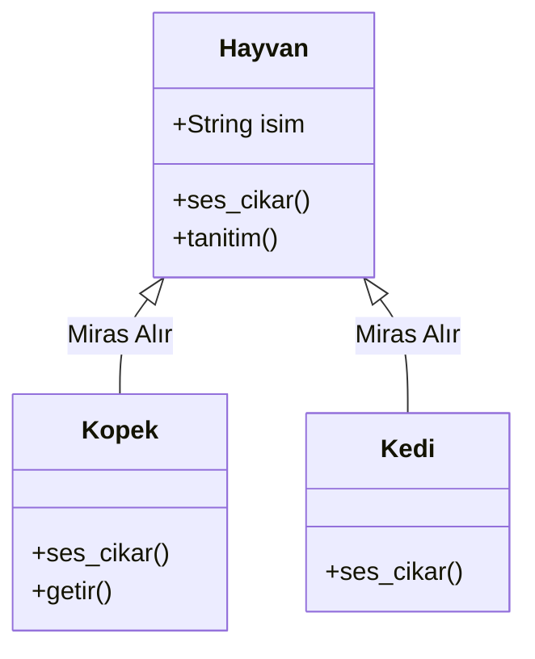

## 📌 Özet
Nesne Yönelimli Programlamanın (OOP) en temel direklerinden biri olan kalıtım (inheritance), bir sınıfın (alt sınıf / subclass) başka bir sınıfın (üst sınıf / parent class) tüm nitelik ve davranışlarını miras almasını sağlayan mekanizmadır. Bu yapı, kodun yeniden kullanılabilirliğini (reusability) maksimize ederken, sınıflar arasında mantıksal bir hiyerarşi ve uzmanlaşma (specialization) oluşturur. Alt sınıflar, miras aldıkları metodları olduğu gibi kullanabilir, "overriding" tekniği ile kendi ihtiyaçlarına göre yeniden tanımlayabilir veya tamamen yeni özellikler ekleyebilirler. Python'ın çoklu kalıtım (multiple inheritance) desteği ve Method Resolution Order (MRO) algoritması, karmaşık sınıf ilişkilerinin tutarlı bir şekilde yönetilmesini sağlar.

## 🧠 Detay



### Temel Kalıtım
```python
class Hayvan:
    def __init__(self, isim):
        self.isim = isim

    def ses_cikar(self):
        print("...")

    def tanitim(self):
        print(f"Ben {self.isim}")

class Kopek(Hayvan):
    def ses_cikar(self):     # override
        print("Hav hav!")

    def getir(self):         # yeni metod
        print("Topu getirdi")

class Kedi(Hayvan):
    def ses_cikar(self):
        print("Miyav!")

kopek = Kopek("Karabaş")
kopek.tanitim()      # Hayvan'dan miras → "Ben Karabaş"
kopek.ses_cikar()    # Override → "Hav hav!"
```

### super() Kullanımı
```python
class Calisan:
    def __init__(self, isim, maas):
        self.isim = isim
        self.maas = maas

class Yonetici(Calisan):
    def __init__(self, isim, maas, departman):
        super().__init__(isim, maas)   # üst sınıf __init__
        self.departman = departman

    def tanitim(self):
        print(f"{self.isim} - {self.departman} Müdürü")
```

### Çoklu Kalıtım
```python
class A:
    def metod(self):
        print("A")

class B(A):
    def metod(self):
        print("B")

class C(A):
    def metod(self):
        print("C")

class D(B, C):
    pass

d = D()
d.metod()   # "B" → MRO: D → B → C → A
print(D.__mro__)
```

### isinstance ve issubclass
```python
kopek = Kopek("Rex")
print(isinstance(kopek, Kopek))   # True
print(isinstance(kopek, Hayvan))  # True
print(issubclass(Kopek, Hayvan))  # True
```

## 💡 Bağlantılar
- [[Python - OOP - Sınıflar ve Nesneler]]
- [[Python - OOP - Kapsülleme]]

## ❓ Sorular / Anlamadıklarım
- MRO (Method Resolution Order) nasıl çalışır?
- Çoklu kalıtımda diamond problem nedir?

## 🔗 Kaynaklar
- https://docs.python.org/tr/3/tutorial/classes.html#inheritance
