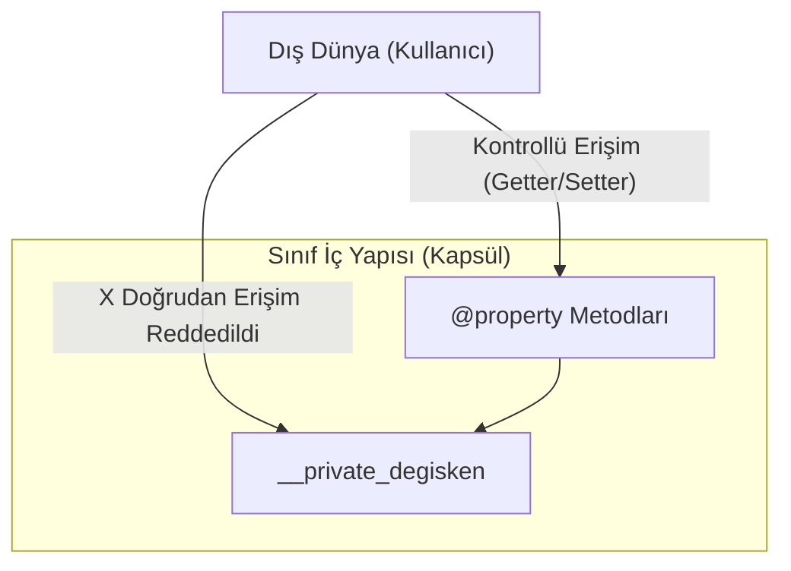

## 📌 Özet
Kapsülleme (encapsulation), bir nesnenin iç durumunu (verilerini) doğrudan dış erişime kapatarak, verilerin sadece nesne tarafından sunulan kontrollü metodlar aracılığıyla değiştirilmesini sağlayan OOP prensibidir. Bu yöntem, verilerin tutarlılığını korumayı, hatalı veri girişini engellemeyi ve yazılımın iç işleyişini dış dünyadan gizleyerek kodun daha güvenli ve bakımı kolay hale gelmesini sağlar. Python'da diğer dillerdeki gibi katı "private" anahtar kelimeleri olmasa da, tek alt çizgi (`_`) ile korumalı (protected) ve çift alt çizgi (`__`) ile gizli (private) veri üyeleri tanımlanarak bu prensip uygulanır. Ayrıca `@property` dekoratörü ile veriye erişim ve veri atama işlemleri (getter/setter) daha "Pythonik" bir şekilde, sanki bir özniteliğe erişiliyormuş gibi yönetilebilir.

## 🧠 Detay



### Erişim Seviyeleri
```python
class BankaHesabi:
    def __init__(self, sahip, bakiye):
        self.sahip = sahip         # public
        self._faiz = 0.05          # protected (convention)
        self.__bakiye = bakiye     # private (name mangling)

    def bakiye_goster(self):
        return self.__bakiye

    def para_yatir(self, miktar):
        if miktar > 0:
            self.__bakiye += miktar
            print(f"{miktar} TL yatırıldı")

    def para_cek(self, miktar):
        if miktar <= self.__bakiye:
            self.__bakiye -= miktar
        else:
            print("Yetersiz bakiye!")
```

### @property ile Getter/Setter
```python
class Insan:
    def __init__(self, isim, yas):
        self.isim = isim
        self.__yas = yas

    @property
    def yas(self):              # getter
        return self.__yas

    @yas.setter
    def yas(self, deger):       # setter
        if deger < 0:
            raise ValueError("Yaş negatif olamaz!")
        self.__yas = deger

    @yas.deleter
    def yas(self):              # deleter
        del self.__yas

kisi = Insan("Ahmet", 30)
print(kisi.yas)      # 30
kisi.yas = 31        # setter çalışır
kisi.yas = -1        # ValueError!
```

### Name Mangling
```python
hesap = BankaHesabi("Ali", 1000)
# hesap.__bakiye  → AttributeError
# hesap._BankaHesabi__bakiye → erişilebilir ama yapılmamalı
print(hesap.bakiye_goster())  # 1000
```

## 💡 Bağlantılar
- [[Python - OOP - Sınıflar ve Nesneler]]
- [[Python - OOP - Kalıtım]]
- [[Python - Decorators]]

## ❓ Sorular / Anlamadıklarım
- `_` (protected) ile `__` (private) ne zaman hangisini kullanmalıyım?
- `@property` ile düz metod arasındaki fark nedir?

## 🔗 Kaynaklar
- https://docs.python.org/tr/3/tutorial/classes.html
