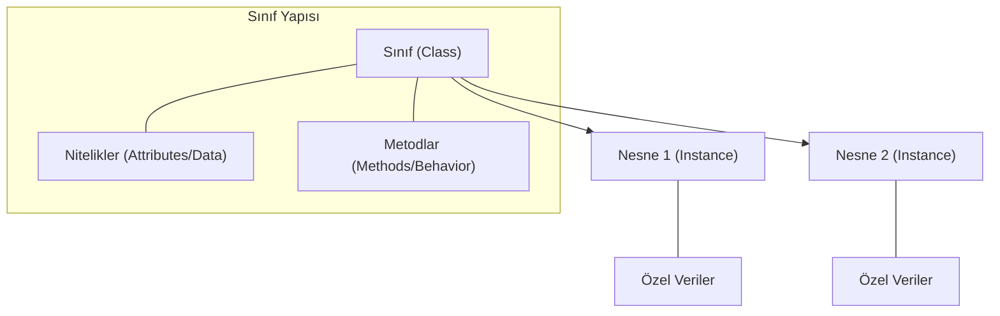

## 📌 Özet
Nesne Yönelimli Programlama (OOP), yazılım geliştirme sürecinde gerçek dünya varlıklarını kod içerisinde modellemek için kullanılan temel bir paradigmadır. Sınıf (class), bir nesnenin sahip olacağı özellikleri ve davranışları tanımlayan soyut bir taslak veya şablon işlevi görür. Nesne (object) ise bu sınıftan türetilen, hafızada yer kaplayan somut bir örnektir; sınıflar veri yapılarını (nitelikler) ve bu veriler üzerinde işlem yapan fonksiyonları (metodlar) bir araya getirerek kodun daha modüler, yeniden kullanılabilir ve yönetilebilir olmasını sağlar.

## 🧠 Detay



### Sınıf Tanımlama
```python
class Araba:
    # Sınıf değişkeni (tüm nesneler paylaşır)
    teker_sayisi = 4

    # Constructor
    def __init__(self, marka, model, yil):
        self.marka = marka    # nesne değişkeni
        self.model = model
        self.yil = yil
        self.hiz = 0

    def hizlan(self, miktar):
        self.hiz += miktar
        print(f"Hız: {self.hiz} km/s")

    def fren(self):
        self.hiz = 0
        print("Durdu")

    def __str__(self):
        return f"{self.yil} {self.marka} {self.model}"
```

### Nesne Oluşturma ve Kullanma
```python
araba1 = Araba("Toyota", "Corolla", 2023)
araba2 = Araba("BMW", "M3", 2024)

araba1.hizlan(60)
print(araba1)         # 2023 Toyota Corolla
print(Araba.teker_sayisi)  # 4
```

### Özel Metodlar (Dunder)
```python
class Nokta:
    def __init__(self, x, y):
        self.x = x
        self.y = y

    def __str__(self):      # print() için
        return f"({self.x}, {self.y})"

    def __repr__(self):     # geliştirici için
        return f"Nokta({self.x}, {self.y})"

    def __add__(self, other):  # + operatörü
        return Nokta(self.x + other.x, self.y + other.y)

    def __len__(self):      # len() için
        return int((self.x**2 + self.y**2)**0.5)
```

### @classmethod ve @staticmethod
```python
class Insan:
    nufus = 0

    def __init__(self, isim):
        self.isim = isim
        Insan.nufus += 1

    @classmethod
    def nufusu_goster(cls):
        print(f"Nüfus: {cls.nufus}")

    @staticmethod
    def selamla():
        print("Merhaba!")
```

## 💡 Bağlantılar
- [[Python - OOP - Kalıtım]]
- [[Python - OOP - Kapsülleme]]
- [[Python - Fonksiyonlar]]

## ❓ Sorular / Anlamadıklarım
- `self` neden her metoda yazılır?
- `__str__` ile `__repr__` ne zaman farklı davranır?

## 🔗 Kaynaklar
- https://docs.python.org/tr/3/tutorial/classes.html
