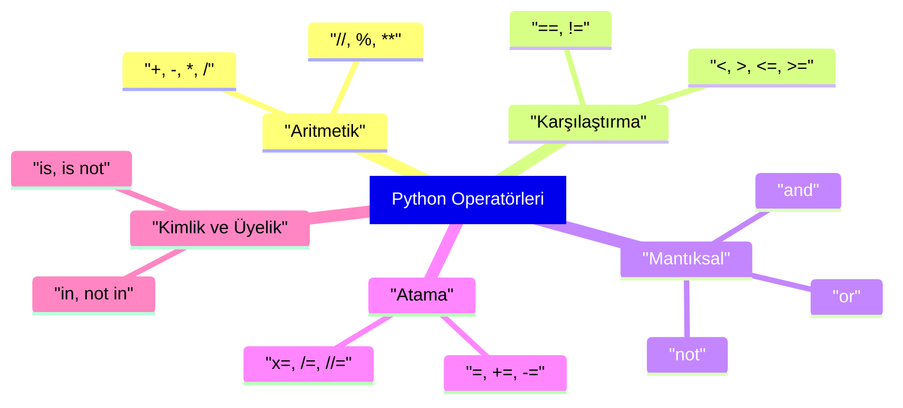

## 📌 Özet
Python'da operatörler, değişkenler ve değerler üzerinde çeşitli manipülasyonlar gerçekleştirmek için kullanılan özel sembollerdir. Bu operatörler; temel matematiksel işlemler için aritmetik, durumları test etmek için karşılaştırma ve birden fazla koşulu birleştirmek için mantıksal operatörler gibi farklı kategorilere ayrılır. Ayrıca, bellek adreslerini kontrol eden kimlik (identity) ve bir koleksiyonun elemanını sorgulayan üyelik (membership) operatörleri, Python'ın veri yönetiminde sunduğu güçlü araçlar arasında yer alarak kodun akışını ve mantığını belirlemede kritik rol oynar.

## 🧠 Detay



### Aritmetik Operatörler
```python
a, b = 10, 3

print(a + b)   # 13  → toplama
print(a - b)   # 7   → çıkarma
print(a * b)   # 30  → çarpma
print(a / b)   # 3.33 → bölme (float)
print(a // b)  # 3   → tam bölme
print(a % b)   # 1   → mod (kalan)
print(a ** b)  # 1000 → üs alma
```

### Karşılaştırma Operatörleri
```python
x, y = 5, 10

print(x == y)  # False → eşit mi
print(x != y)  # True  → eşit değil mi
print(x > y)   # False → büyük mü
print(x < y)   # True  → küçük mü
print(x >= y)  # False → büyük eşit mi
print(x <= y)  # True  → küçük eşit mi
```

### Mantıksal Operatörler
```python
a, b = True, False

print(a and b)  # False → ikisi de True olmalı
print(a or b)   # True  → biri True olması yeterli
print(not a)    # False → tersine çevirir
```

### Atama Operatörleri
```python
x = 10
x += 5   # x = x + 5 → 15
x -= 3   # x = x - 3 → 12
x *= 2   # x = x * 2 → 24
x //= 4  # x = x // 4 → 6
```

### Kimlik ve Üyelik Operatörleri
```python
# is → aynı nesne mi
a = [1, 2]
b = a
print(a is b)    # True

# in → içinde mi
liste = [1, 2, 3]
print(2 in liste)    # True
print(5 not in liste) # True
```

## 💡 Bağlantılar
- [[Python - Değişkenler ve Veri Tipleri]]
- [[Python - Koşullar (if-elif-else)]]
- [[Python - Döngüler (for-while)]]

## ❓ Sorular / Anlamadıklarım
- `==` ile `is` arasındaki fark tam olarak nedir?
- `//` tam bölme ile `int(a/b)` aynı sonucu mu verir?

## 🔗 Kaynaklar
- https://docs.python.org/tr/3/reference/expressions.html#operator-precedence
