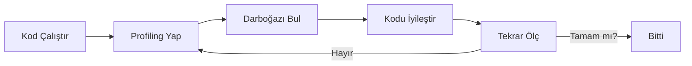

## 📌 Özet
Profiling, bir programın çalışma sırasındaki performansını (çalışma süresi, bellek kullanımı vb.) ölçme işlemidir. Python da "Önce çalıştır, sonra ölç, en son optimize et" prensibi geçerlidir. Tahmin yürütmek yerine profiling araçları kullanarak darboğazları (bottlenecks) tespit etmek kritiktir.

## 🧠 Detay



### 1. Temel Profiling Araçları
- **timeit:** Küçük kod parçacıklarının çalışma süresini ölçer.
- **cProfile:** Tüm programın veya fonksiyonların kaç kez çağrıldığını ve ne kadar sürdüğünü detaylı raporlar.
- **line_profiler:** Kodun satır satır ne kadar vakit harcadığını gösterir (daha spesifik).
- **memory_profiler:** Bellek tüketimini satır bazlı ölçer.

### 2. Örnek: cProfile Kullanımı
```bash
python -m cProfile -s time betik.py
```

Kod içinden kullanım:
```python
import cProfile

def yavas_is():
    sum([i**2 for i in range(1000000)])

cProfile.run("yavas_is()")
```

### 3. Optimizasyon Stratejileri
- Uygun veri yapısı seçimi (Set vs List).
- Gereksiz döngülerin kaldırılması.
- List comprehension ve Built-in fonksiyonların kullanımı.
- Kritik bölümlerin C (Cython) veya Rust ile yazılması.

## 💡 Bağlantılar
- [[Python - List & Dict Comprehension]]
- [[Python - Generators]]

## ❓ Sorular / Anlamadıklarım
- "Premature optimization is the root of all evil" sözü ne anlama gelir?
- Bellek sızıntıları (memory leaks) profiling ile nasıl yakalanır?

## 🔗 Kaynaklar
- Python Docs: The Python Profilers
- Real Python: Python Profiling
