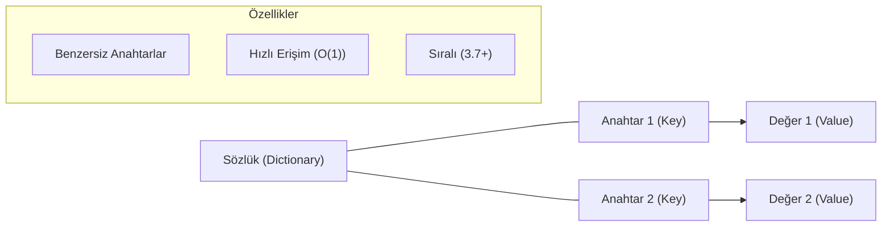

## 📌 Özet
Sözlükler (Dictionary), Python'da anahtar-değer (key-value) mantığına dayanan, oldukça hızlı ve verimli bir veri yapısıdır. Listelerin aksine elemanlara indis numaralarıyla değil, benzersiz (hashable) anahtarlar üzerinden erişim sağlanır, bu da veri aramayı çok daha performanslı hale getirir. Python 3.7 ve üzeri sürümlerde sıralı (ordered) bir yapı sergileyen sözlükler, karmaşık verileri yapılandırmak ve JSON gibi veri formatlarını modellemek için yazılım dünyasında standart olarak kabul edilir.

## 🧠 Detay



### Sözlük Oluşturma
```python
kisi = {
    "isim": "Ahmet",
    "yas": 30,
    "sehir": "İstanbul"
}

bos = {}
bos2 = dict()
```

### Elemanlara Erişim
```python
print(kisi["isim"])           # Ahmet
print(kisi.get("yas"))        # 30
print(kisi.get("boy", 175))   # 175 (varsayılan değer)
```

### Ekleme ve Güncelleme
```python
kisi["meslek"] = "Mühendis"   # yeni ekle
kisi["yas"] = 31               # güncelle
kisi.update({"sehir": "Ankara", "boy": 180})
```

### Silme
```python
del kisi["sehir"]
kisi.pop("meslek")             # siler ve değeri döndürür
kisi.clear()                   # tümünü siler
```

### Döngü ile Gezinme
```python
kisi = {"isim": "Ahmet", "yas": 30}

for anahtar in kisi:
    print(anahtar)

for deger in kisi.values():
    print(deger)

for anahtar, deger in kisi.items():
    print(f"{anahtar}: {deger}")
```

### Sözlük Metodları
```python
print(kisi.keys())    # dict_keys(['isim', 'yas'])
print(kisi.values())  # dict_values(['Ahmet', 30])
print(kisi.items())   # dict_items([...])
print("isim" in kisi) # True → anahtar kontrolü
```

### Dict Comprehension
```python
kareler = {x: x**2 for x in range(5)}
# {0: 0, 1: 1, 2: 4, 3: 9, 4: 16}
```

## 💡 Bağlantılar
- [[Python - Listeler]]
- [[Python - Demetler (Tuple)]]
- [[Python - List & Dict Comprehension]]
- [[Python - JSON İşlemleri]]

## ❓ Sorular / Anlamadıklarım
- `dict.get()` ile `dict[]` arasındaki fark ne zaman önemli?
- İç içe sözlüklerde nasıl gezinilir?

## 🔗 Kaynaklar
- https://docs.python.org/tr/3/tutorial/datastructures.html#dictionaries
