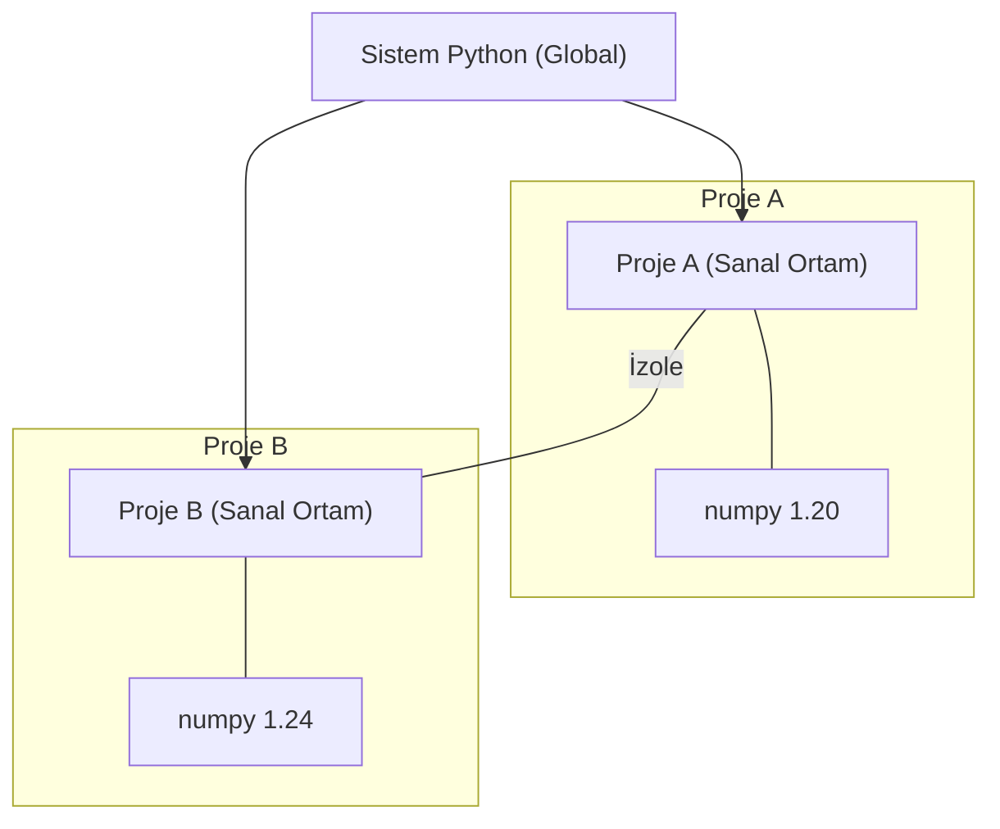

## 📌 Özet
Sanal Ortam (Virtual Environment), Python projeleri için izole edilmiş çalışma alanları yaratarak kütüphane ve bağımlılık çakışmalarını ortadan kaldıran kritik bir araçtır. Her proje, kendi sistem kütüphanelerinden bağımsız olarak belirli kütüphane sürümlerine sahip olabilir, bu da 'benim makinemde çalışıyor ama sunucuda çalışmıyor' gibi sorunların önüne geçer. Yazılım geliştirme sürecinde her yeni projeye bir sanal ortam oluşturarak başlamak, temiz ve yönetilebilir bir kod ekosistemi kurmanın en temel adımıdır.

## 🧠 Detay



### Neden Gerekli?
- Proje A: numpy 1.20 kullanıyor
- Proje B: numpy 1.24 kullanıyor
- Global kurulum → çakışma!
- Çözüm → her projeye ayrı ortam

### Oluşturma ve Aktifleştirme
```bash
# Oluştur
python -m venv venv

# Aktifleştir (Windows)
venv\Scripts\activate

# Aktifleştir (Mac/Linux)
source venv/bin/activate

# Deaktif et
deactivate
```

### Paket Yönetimi
```bash
# Paket kur
pip install pandas

# Tüm paketleri kaydet
pip freeze > requirements.txt

# Başka ortamda kur
pip install -r requirements.txt

# Paket kaldır
pip uninstall pandas

# Kurulu paketler
pip list
```

### .gitignore
```
# Virtual environment klasörü git'e eklenmemeli
venv/
__pycache__/
*.pyc
```

### Proje Yapısı
```
projem/
  venv/              ← sanal ortam (git'e ekleme)
  src/
    main.py
  requirements.txt   ← bağımlılıklar (git'e ekle)
  .gitignore
  README.md
```

## 💡 Bağlantılar
- [[Python - pip ve Paket Yönetimi]]
- [[Python - Modüller ve Paketler]]

## ❓ Sorular / Anlamadıklarım
- `venv` ile `conda` arasındaki fark nedir?
- `requirements.txt` ile `pyproject.toml` farkı ne?

## 🔗 Kaynaklar
- https://docs.python.org/tr/3/library/venv.html
