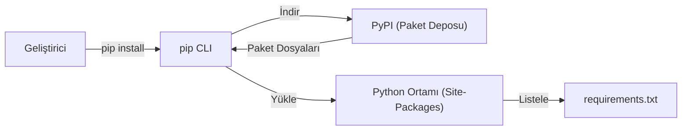

## 📌 Özet
pip, Python programlama dili için standart paket yönetim sistemidir ve PyPI (Python Package Index) deposundaki geniş kütüphane ekosistemine erişim sağlar. Geliştiricilerin projelerinde ihtiyaç duyduğu harici bağımlılıkları kolayca yüklemesine, sürüm kontrolü yapmasına ve kaldırmasına olanak tanıyarak yazılım geliştirme sürecini hızlandırır. 'requirements.txt' dosyası aracılığıyla proje bağımlılıklarının dökümünü çıkararak, kodun farklı makinelerde veya sunucularda aynı kütüphane sürümleriyle tutarlı bir şekilde çalışmasını garanti eder.

## 🧠 Detay



### Temel pip Komutları
```bash
# Paket kur
pip install numpy

# Belirli versiyon
pip install numpy==1.24.0
pip install numpy>=1.20

# Güncelle
pip install --upgrade numpy

# Kaldır
pip uninstall numpy

# Bilgi göster
pip show numpy

# Arama
pip search numpy   # (kısıtlı)
```

### requirements.txt
```bash
# Oluştur
pip freeze > requirements.txt

# Kur
pip install -r requirements.txt
```

```
# requirements.txt örneği
numpy==1.24.0
pandas==2.0.1
matplotlib==3.7.1
scikit-learn==1.3.0
```

### Data Science için Temel Paketler
```bash
pip install numpy pandas matplotlib seaborn scikit-learn jupyter
```

### pip Alternatifi: conda
```bash
conda install numpy
conda create -n myenv python=3.11
conda activate myenv
```

### Paket Versiyonlarını Kontrol Et
```python
import numpy
print(numpy.__version__)

import pkg_resources
print(pkg_resources.get_distribution("numpy").version)
```

## 💡 Bağlantılar
- [[Python - Virtual Environment]]
- [[Python - Modüller ve Paketler]]

## ❓ Sorular / Anlamadıklarım
- `pip` ile `pip3` arasındaki fark nedir?
- `conda` ne zaman `pip`'den daha iyi?

## 🔗 Kaynaklar
- https://pip.pypa.io/en/stable/
- https://pypi.org
