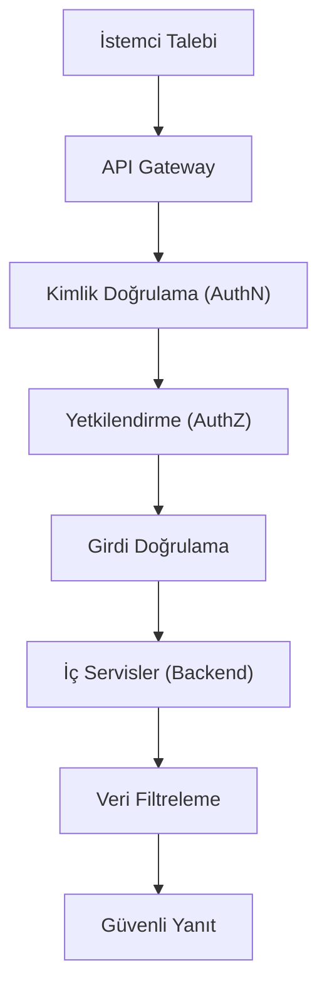

## 📌 Özet
API güvenliği, modern yazılım mimarilerinde sistemler arası veri transferini sağlayan Uygulama Programlama Arayüzlerinin (API) yetkisiz erişim, veri sızıntısı ve manipülasyonlara karşı korunmasıdır. Mikroservislerin ve mobil uygulamaların yaygınlaşmasıyla birlikte API'ler, saldırganlar için en geniş saldırı yüzeylerinden biri haline gelmiştir. Geleneksel web uygulamalarından farklı olarak API'ler, doğrudan ham veriyi sunduğu için "Broken Object Level Authorization" gibi özgün zafiyetler barındırır. Güvenli bir API stratejisi; katı kimlik doğrulama (OAuth2, JWT), hız sınırlama (Rate Limiting) ve girdi doğrulama mekanizmalarını içermelidir. OWASP API Security Top 10 listesi, bu alandaki risklerin yönetilmesi için temel bir rehber sunar.

## 🧠 Detay

### 1. Temel API Riskleri (OWASP API Top 10)
- **BOLA (Broken Object Level Authorization):** Bir kullanıcının ID değiştirerek başkasına ait veriyi çekebilmesi.
- **BFLA (Broken Function Level Authorization):** Düşük yetkili bir kullanıcının admin fonksiyonlarını tetikleyebilmesi.
- **Mass Assignment:** Modeldeki gizli alanların (örn: `is_admin`) istemciden gelen veriyle güncellenebilmesi.

### 2. Savunma Mekanizmaları
- **MFA ve Token Güvenliği:** API erişiminde sadece şifre değil, kısa ömürlü ve imzalı tokenlar kullanılmalıdır.
- **Rate Limiting:** DoS saldırılarını engellemek için IP veya kullanıcı bazlı istek sınırları konulmalıdır.
- **Logging ve Monitoring:** Beklenmedik trafik artışları ve hata kodları anlık olarak izlenmelidir.

## 💡 Bağlantılar
- [[Siber Güvenlik - Web Uygulama Güvenliği (OWASP Top 10)]]
- [[Siber Güvenlik - Kimlik Doğrulama ve Yetkilendirme]]

## ❓ Sorular / Anlamadıklarım

## 🔗 Kaynaklar
- OWASP API Security Project
- API Security Checklist (GitHub)
