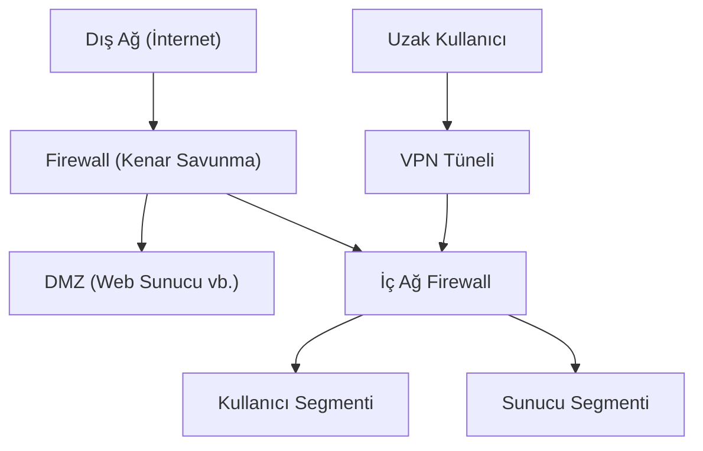

## 📌 Özet
Ağ güvenliği, bir ağ altyapısının ve üzerinden geçen verilerin yetkisiz erişim, kötüye kullanım veya sızmalara karşı korunması sürecidir. Modern ağ savunması, TCP/IP protokol yığınının her katmanında (Physical'dan Application'a kadar) farklı güvenlik kontrollerinin uygulanmasını gerektirir. Güvenlik duvarları (Firewall), ağ trafiğini denetleyen ilk savunma hattını oluştururken; VPN teknolojileri güvensiz ağlar üzerinde şifreli tüneller kurarak veri mahremiyetini sağlar. Ayrıca, Saldırı Tespit ve Engelleme Sistemleri (IDS/IPS), anomali tespiti yaparak ağ içerisindeki yanal hareketleri kısıtlar. Güvenli bir ağ mimarisi, "Zero Trust" (Sıfır Güven) prensibiyle her bağlantıyı şüpheli kabul ederek sürekli doğrulamalıdır.

## 🧠 Detay

### 1. Güvenlik Duvarı (Firewall) Teknolojileri
- **Packet Filtering:** Kaynak/hedef IP ve port bilgilerine göre basit kurallar uygular.
- **Stateful Inspection:** Paketlerin durumunu takip eder ve aktif bağlantıların parçası olup olmadığını denetler.
- **Next-Generation Firewall (NGFW):** Uygulama katmanında (L7) filtreleme ve derin paket inceleme (DPI) yapar.

### 2. Tehdit Algılama ve Engelleme
- **IDS (Intrusion Detection System):** Trafiği izler, saldırı tespiti yapar ve alarm üretir (Pasif).
- **IPS (Intrusion Prevention System):** Şüpheli trafiği anında durdurur ve bloklar (Aktif).

### 3. Ağ Segmentasyonu
Ağı "VLAN"lar üzerinden mantıksal parçalara bölmek, bir sistemin ele geçirilmesi durumunda saldırganın tüm ağa yayılmasını (lateral movement) engeller.

## 💡 Bağlantılar
- [[Siber Güvenlik - Giriş ve Temel Kavramlar (CIA, Threat Model)]]
- [[Siber Güvenlik - Zero Trust Mimarisi]]

## ❓ Sorular / Anlamadıklarım

## 🔗 Kaynaklar
- Cisco Networking Academy
- SANS Network Security Resources
