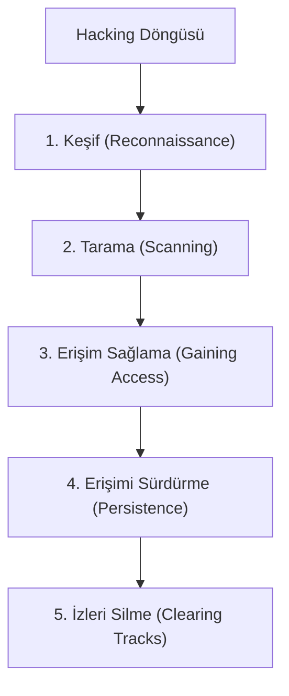

## 📌 Özet
Certified Ethical Hacker (CEH), siber güvenlik dünyasında saldırganların kullandığı araç ve teknikleri etik bir çerçevede öğrenmeyi amaçlayan profesyonel bir sertifikasyon programıdır. "Saldırganı durdurmak için saldırgan gibi düşün" felsefesine dayanan bu eğitim, bir sistemin zayıf noktalarını tespit etme ve bunları raporlama sürecini sistematik bir yaklaşımla ele alır. Hacking ya yaşam döngüsünün beş aşaması (Keşif, Tarama, Erişim Sağlama, Erişimi Sürdürme, İzleri Silme) müfredatın temelini oluşturur. Modern CEH içerikleri; bulut güvenliği, IoT zafiyetleri ve ileri düzey zararlı yazılım analizlerini de kapsamaktadır. Bu sertifika, güvenlik profesyonellerine teknik becerilerin yanı sıra saldırgan bakış açısı (offensive mindset) kazandırmayı hedefler.

## 🧠 Detay

### 1. Bilgi Toplama ve Tarama
- **Footprinting:** Hedef hakkında pasif (Whois, Shodan) ve aktif (Nmap) bilgi toplama.
- **Vulnerability Scanning:** Hedefteki servislerin zafiyetlerinin tespiti (Nessus).

### 2. Sistem Hacking Teknikleri
- **Sniffing:** Ağ trafiğinin izlenmesi (Wireshark).
- **Session Hijacking:** Kullanıcı oturumlarının ele geçirilmesi.
- **Web Hacking:** SQL Injection ve XSS saldırıları.

### 3. Savunma ve Etik Kurallar
CEH, sadece teknik beceriyi değil, aynı zamanda bu becerilerin yasal ve ahlaki sınırlar içerisinde kullanılmasını şart koşar.

## 💡 Bağlantılar
- [[Siber Güvenlik - Sızma Testi Metodolojisi]]
- [[Siber Güvenlik - Güvenlik Açığı Tarama (Nmap, Nessus)]]

## ❓ Sorular / Anlamadıklarım

## 🔗 Kaynaklar
- EC-Council Official Site
- CEH v12 Study Guide
