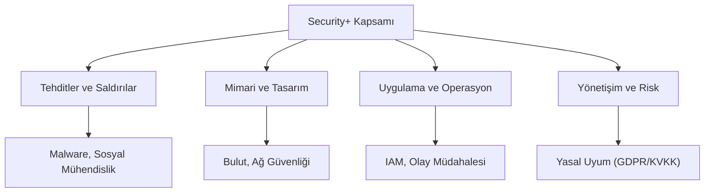

## 📌 Özet
CompTIA Security+, dünya çapında tanınan ve siber güvenlik kariyerine adım atmak isteyen profesyoneller için temel kabul edilen uluslararası bir sertifikasyondur. Sınav müfredatı; tehditler, saldırılar ve zafiyetlerden mimari tasarıma, operasyonel güvenlikten kurumsal risk yönetimine kadar geniş bir yelpazeyi kapsar. Bu sertifika, bir güvenlik analistinin bilmesi gereken temel terminolojiyi ve savunma metodolojilerini standartlaştırır. Security+ odaklı bir çalışma, hem teknik altyapıyı güçlendirir hem de kurumsal güvenlik politikalarının oluşturulması süreçlerinde vizyon kazandırır. Güncel sınav (SY0-701) konuları, bulut güvenliği ve otomasyon gibi modern konuları da içermektedir.

## 🧠 Detay

### 1. Genel Tehdit Ortamı
Saldırı aktörlerinin (Hackerlar, İç tehditler, Devlet destekli gruplar) tanınması ve motivasyonlarının anlaşılması.

### 2. Güvenlik Operasyonları
Sistemlerin sıkılaştırılması (Hardening), log yönetimi ve zafiyet tarama süreçlerinin kurumsal düzeyde yönetilmesi.

### 3. Risk ve Uyumluluk
İş sürekliliği planlaması (DRP/BCP) ve veri mahremiyeti standartlarına uyum süreçleri.

## 💡 Bağlantılar
- [[Siber Güvenlik - Giriş ve Temel Kavramlar (CIA, Threat Model)]]
- [[Siber Güvenlik - Olay Müdahalesi (Incident Response)]]

## ❓ Sorular / Anlamadıklarım

## 🔗 Kaynaklar
- CompTIA Official Training
- Professor Messer Security+ Notes
