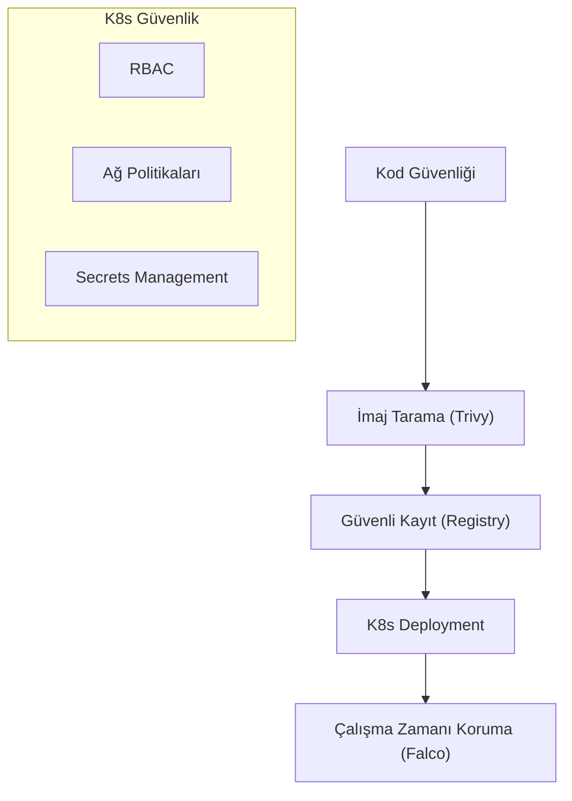

## 📌 Özet
Konteynerleştirme ve Kubernetes, uygulama dağıtım süreçlerini devrimselleştirirken beraberinde yeni ve karmaşık güvenlik zorlukları getirmiştir. Konteyner güvenliği; uygulama kodundan başlayarak imajın oluşturulması (Build), güvenli bir depoda saklanması (Registry) ve çalışma zamanı (Runtime) süreçlerini kapsayan uçtan uca bir yaklaşımdır. Kubernetes ise bu konteynerleri yöneten devasa bir orkestrasyon sistemi olarak, yanlış yapılandırmalar sonucunda geniş bir saldırı yüzeyi sunabilir. "Shift-Left" yaklaşımıyla güvenliğin CI/CD süreçlerine entegre edilmesi ve "Default Deny" ağ politikalarının uygulanması bu ekosistemin korunması için hayatidir. Bu notta, modern konteyner altyapılarının sıkılaştırılması (Hardening) teknikleri ele alınmaktadır.

## 🧠 Detay

### 1. İmaj Güvenliği (Build Phase)
- **Minimal İmajlar:** Sadece uygulamanın çalışması için gereken paketlerin tutulması (Alpine, Distroless).
- **CVE Taraması:** İmaj içerisindeki kütüphanelerde bilinen açıkların tespiti.

### 2. Kubernetes Sıkılaştırma (Hardening)
- **RBAC (Role-Based Access Control):** Kullanıcılara ve servislere sadece işlerini yapacak kadar yetki verilmesi.
- **Network Policies:** Pod'lar arası trafiğin kısıtlanması (İzolasyon).

### 3. Runtime Güvenliği
Konteynerlerin çalışma anındaki davranışlarının izlenmesi ve beklenmedik sistem çağrılarının bloklanması.

## 💡 Bağlantılar
- [[Siber Güvenlik - API Güvenliği]]
- [[Siber Güvenlik - Secrets Management]]

## ❓ Sorular / Anlamadıklarım

## 🔗 Kaynaklar
- CNCF Security Guide
- CIS Benchmarks for Kubernetes
