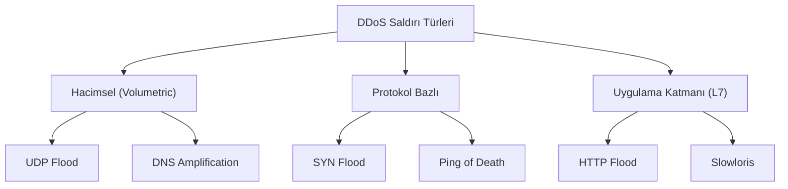

## 📌 Özet
DoS (Denial of Service) ve DDoS (Distributed Denial of Service) saldırıları, bir sistemin, ağın veya servisin kaynaklarını tüketerek meşru kullanıcıların erişimini engellemeyi amaçlar. DoS tek bir kaynaktan yapılırken, DDoS dünya çapında dağılmış binlerce zombi cihazdan (Botnet) oluşan bir ağ üzerinden gerçekleştirilir. Bu saldırılar hacimsel, protokol bazlı veya uygulama katmanı düzeyinde olabilir. Hedef sistemin bant genişliğini, CPU gücünü veya bellek kapasitesini aşırı yükleyerek servis dışı kalmasına neden olur. Bu doküman, DDoS türlerini, Botnet kavramını ve modern savunma teknolojilerini ele alır.

## 🧠 Detay

### 1. Saldırı Mekanizmaları
- **Amplification:** Küçük bir sorgu gönderip kurbanın IP adresiyle çok büyük bir yanıtın dönmesini sağlama.
- **Botnet:** Zararlı yazılım bulaşmış binlerce IoT veya PC'den oluşan saldırı ordusu.

### 2. Savunma Stratejileri
- **Anycast Network:** Trafiği coğrafi olarak dağıtarak yükü hafifletme.
- **Scrubbing Centers:** Trafiği temizleyip sadece meşru olanları hedefe iletme.
- **Rate Limiting:** IP bazlı istek sınırlandırma.

## 💡 Bağlantılar
- [[Siber Güvenlik - Giriş ve Temel Kavramlar (CIA, Threat Model)]]
- [[Siber Güvenlik - Ağ Güvenliği Temelleri (TCP-IP, Firewall, VPN)]]

## ❓ Sorular / Anlamadıklarım

## 🔗 Kaynaklar
- Cloudflare DDoS Learning Center
- Radware Global Application & Network Security Report
