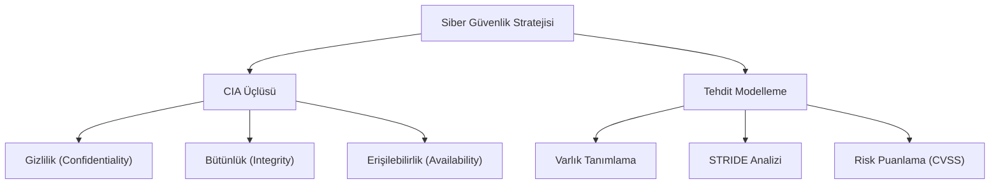

## 📌 Özet
Siber güvenlik, dijital dünyadaki her türlü varlığın (veri, sistem, ağ) yetkisiz erişim, kullanım, ifşa, kesinti veya imha edilmesine karşı korunması sürecidir. Bu disiplinin çekirdek modeli olan CIA üçlüsü (Gizlilik, Bütünlük, Erişilebilirlik), tüm güvenlik politikalarının ve kontrollerinin temel ölçütüdür. Bilginin sadece yetkili kişilerce görülmesi, yetkisizce değiştirilmemesi ve ihtiyaç duyulduğunda ulaşılabilir olması hedeflenir. Tehdit modelleme ise, bir sistemin saldırgan gözüyle analiz edilerek zayıf noktaların ve potansiyel saldırı vektörlerinin sistematik olarak belirlenmesidir. Modern siber güvenlik, sadece teknik bir savunma değil, aynı zamanda proaktif bir risk yönetimi ve kurumsal dayanıklılık stratejisidir.

## 🧠 Detay

### 1. CIA Üçlüsü ve Genişletilmiş Prensipler
- **Gizlilik:** Şifreleme ve ACL ile erişim kısıtlama.
- **Bütünlük:** Hashing ve dijital imzalar ile veri tamlığını koruma.
- **Erişilebilirlik:** Yedekleme ve yedekli sistemler ile süreklilik sağlama.

### 2. Tehdit Modelleme (STRIDE)
Sisteme yönelik tehditleri sınıflandırmak için kullanılır:
- **Spoofing, Tampering, Repudiation, Information Disclosure, Denial of Service, Elevation of Privilege.**

## 💡 Bağlantılar
- [[Siber Güvenlik - Ağ Güvenliği Temelleri (TCP-IP, Firewall, VPN)]]
- [[Siber Güvenlik - Sızma Testi Metodolojisi]]

## ❓ Sorular / Anlamadıklarım

## 🔗 Kaynaklar
- NIST Cybersecurity Framework
- OWASP Threat Modeling Guides
