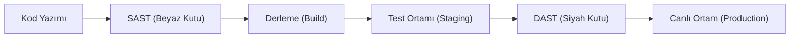

## 📌 Özet
Güvenli kod yazımı, bir uygulamanın tasarım aşamasından başlayarak canlıya alınana kadar tüm süreçte güvenlik zafiyetlerini minimize etmeyi amaçlayan proaktif bir yaklaşımdır. "Shift-Left" prensibiyle güvenliği geliştirme döngüsünün (SDLC) en başına taşımak, hataların üretim ortamına ulaşmadan ve maliyeti artmadan çözülmesini sağlar. Bu süreçte kullanılan iki temel analiz yöntemi vardır: SAST (Statik Analiz) ve DAST (Dinamik Analiz). SAST, kod henüz çalıştırılmadan kaynak dosyasını tarayarak mantıksal hataları bulurken; DAST, çalışan uygulamaya dışarıdan saldırılar simüle ederek zafiyetleri tespit eder. Bu notta, her iki yöntemin avantajları ve modern CI/CD süreçlerine entegrasyonu teknik olarak incelenmektedir.

## 🧠 Detay

### 1. SAST (Static Application Security Testing)
- **Kapsam:** SQL enjeksiyon riskli fonksiyonlar, hardcoded şifreler.
- **Araçlar:** SonarQube, Snyk, Checkmarx.

### 2. DAST (Dynamic Application Security Testing)
- **Kapsam:** XSS, CSRF, yanlış konfigürasyonlar.
- **Araçlar:** OWASP ZAP, Burp Suite Enterprise.

### 3. DevSecOps Entegrasyonu
Güvenlik testlerinin boru hatlarına (pipelines) otomatik adımlar olarak eklenmesi süreci.

## 💡 Bağlantılar
- [[Siber Güvenlik - OWASP Top 10 (SQLi, XSS, CSRF)]]
- [[Siber Güvenlik - API Güvenliği]]

## ❓ Sorular / Anlamadıklarım

## 🔗 Kaynaklar
- OWASP Software Assurance Maturity Model
- Snyk Developer Security Education
