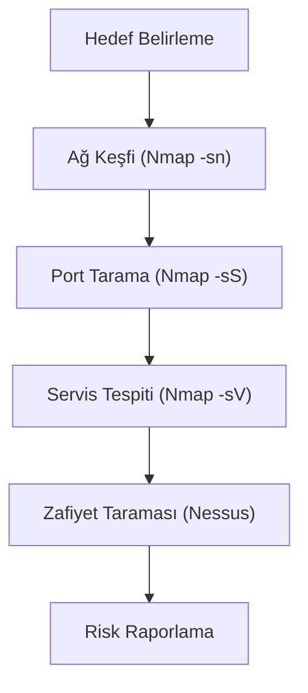

## 📌 Özet
Güvenlik açığı tarama, bir ağdaki veya sistemdeki potansiyel zayıflıkları otomatik veya manuel yöntemlerle tespit etme sürecidir. Bu süreç, siber savunmanın en kritik adımlarından biridir çünkü saldırganlardan önce zafiyetleri bulup kapatmayı sağlar. Nmap gibi araçlar ağ keşfi, açık port tespiti ve işletim sistemi parmak izi analizi için kullanılırken; Nessus gibi kapsamlı tarayıcılar bilinen zafiyet veri tabanları (CVE) ile karşılaştırma yaparak detaylı risk raporları sunar. Düzenli taramalar, sistemlerin güncel tehditlere karşı direncini ölçmek ve yama yönetimini (patch management) optimize etmek için şarttır.

## 🧠 Detay

### 1. Nmap Kullanım Senaryoları
- **Hızlı Tarama:** `nmap -F <hedef>`
- **Tam Denetim:** `nmap -sV -sC -A <hedef>`
- **Script Kullanımı (NSE):** Otomatik zafiyet testleri.

### 2. Nessus ve Kurumsal Tarama
Yama yönetim süreçlerine girdi sağlayan, kritiklik derecesine göre bulguları listeleyen profesyonel araç.

## 💡 Bağlantılar
- [[Siber Güvenlik - Sızma Testi Metodolojisi]]
- [[Siber Güvenlik - Ağ Güvenliği Temelleri (TCP-IP, Firewall, VPN)]]

## ❓ Sorular / Anlamadıklarım

## 🔗 Kaynaklar
- Nmap Official Reference Guide
- Tenable Nessus Documentation
