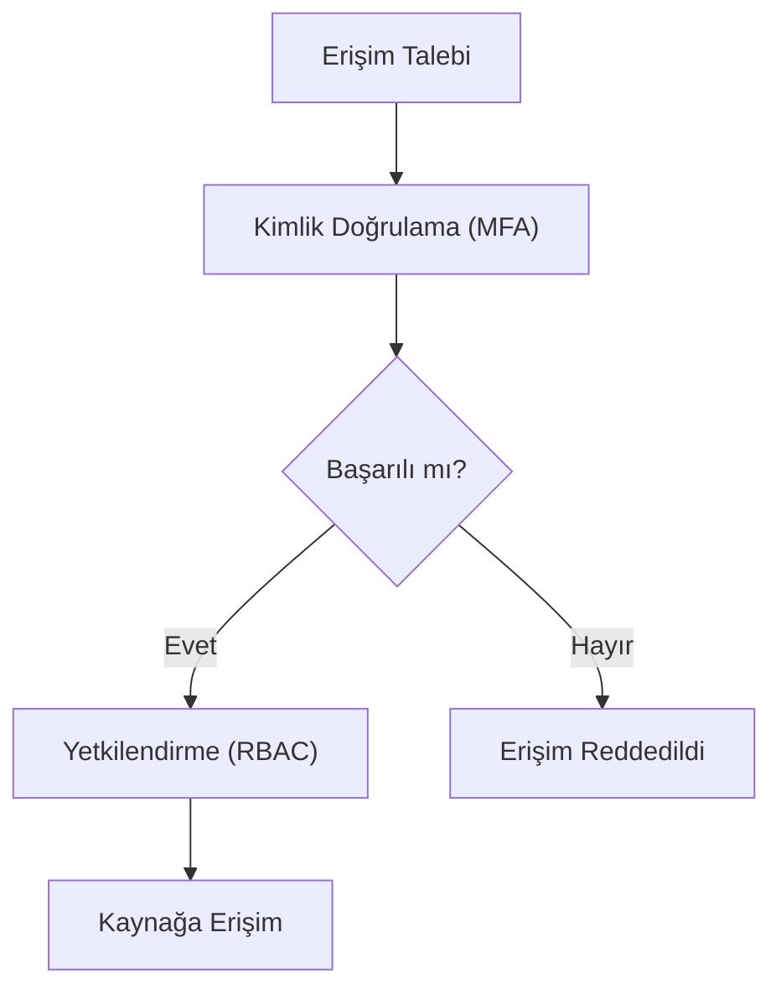

## 📌 Özet
Kimlik doğrulama (Authentication) ve yetkilendirme (Authorization), siber güvenliğin erişim kontrol katmanını (IAM) oluşturan iki temel süreçtir. Kimlik doğrulama "Kimsiniz?" sorusuna yanıt arayarak kullanıcının iddia ettiği kişi olduğunu kanıtlamasını isterken; yetkilendirme "Bu kişinin neleri yapmaya izni var?" sorusunu cevaplar. Çok Faktörlü Kimlik Doğrulama (MFA) ve Rol Tabanlı Erişim Kontrolü (RBAC) bu süreçlerin güvenliğini artıran kritik mekanizmalardır. Modern sistemlerde kullanıcı yönetimi merkezi dizin servisleri ve standart protokoller (OAuth 2.0, SAML) üzerinden gerçekleştirilir.

## 🧠 Detay

### 1. Kimlik Doğrulama Faktörleri
- **Bildiğiniz:** Şifre, PIN.
- **Sahip olduğunuz:** Akıllı telefon (OTP), YubiKey.
- **Olduğunuz:** Parmak izi, yüz tanıma.

### 2. Yetkilendirme Modelleri
- **RBAC:** Rol bazlı (Admin, User).
- **ABAC:** Öznitelik bazlı (Departman, Konum, Saat).

### 3. Protokoller
- **OAuth 2.0:** Delegasyon (şifre paylaşmadan yetki verme).
- **SAML:** Kurumsal SSO (Single Sign-On).

## 💡 Bağlantılar
- [[Siber Güvenlik - Kriptografi Temelleri (Simetrik, Asimetrik, Hash)]]
- [[Siber Güvenlik - Zero Trust Mimarisi]]

## ❓ Sorular / Anlamadıklarım

## 🔗 Kaynaklar
- Auth0 IAM 101 Guide
- OWASP Authentication Cheat Sheet
