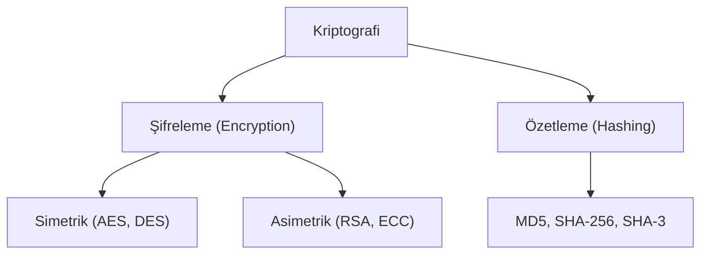

## 📌 Özet
Kriptografi, bilgiyi yetkisiz erişime karşı korumak ve verinin orijinalliğini kanıtlamak için matematiksel algoritmalar kullanan veri güvenliği bilimidir. Modern siber güvenliğin bel kemiği olan bu disiplin; gizlilik (encryption), bütünlük (hashing) ve inkar edememe (digital signatures) prensiplerini hayata geçirir. Simetrik şifreleme hız avantajıyla büyük verileri korurken, asimetrik şifreleme güvenli anahtar değişimi problemini çözerek güvenli internet iletişiminin yolunu açar. Hash fonksiyonları ise verinin "parmak izini" çıkararak değiştirilip değiştirilmediğini saniyeler içinde doğrular.

## 🧠 Detay

### 1. Simetrik ve Asimetrik Şifreleme
- **Simetrik:** Tek anahtar kullanılır. Hızlıdır.
- **Asimetrik:** İki anahtar (Public/Private) kullanılır. Güvenli anahtar değişimi sağlar.

### 2. Hash Fonksiyonları
Veriyi geri döndürülemez bir özete dönüştürür. Şifre saklama ve dosya bütünlüğü kontrolü için kullanılır.

## 💡 Bağlantılar
- [[Siber Güvenlik - Giriş ve Temel Kavramlar (CIA, Threat Model)]]
- [[Siber Güvenlik - Kimlik Doğrulama ve Yetkilendirme]]

## ❓ Sorular / Anlamadıklarım

## 🔗 Kaynaklar
- Khan Academy Cryptography
- OWASP Cryptographic Storage Cheat Sheet
