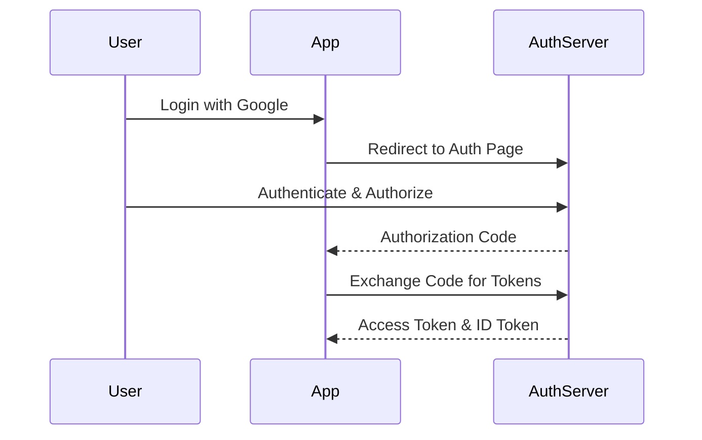

---
tarih: 2026-06-06
konu: OAuth2 & OIDC
etiket: [security, authentication, authorization, oauth2, oidc]
kaynak: Gemini CLI
zorluk: İleri
---

## 📌 Ozet
OAuth2, bir uygulamanın kullanıcı adına başka bir servisteki verilere erişmesine (Authorization) izin veren bir protokoldür. OIDC (OpenID Connect) ise OAuth2 üzerine inşa edilmiş bir kimlik doğrulama (Authentication) katmanıdır. Google veya GitHub ile giriş yapma sistemlerinin temelidir.

## 🧠 Detay

### 1. Temel Kavramlar
- **Access Token:** Kaynaklara erişim anahtarı (Kısa ömürlü).
- **Refresh Token:** Yeni access token almak için kullanılır (Uzun ömürlü).
- **ID Token:** Kullanıcı bilgilerini (JWT formatında) içerir (OIDC ye özeldir).

## 💡 Baglantilar
- [[API - Güvenlik ve Kimlik Doğrulama (JWT)]]
- [[Siber Güvenlik - Kimlik Doğrulama ve Yetkilendirme]]
