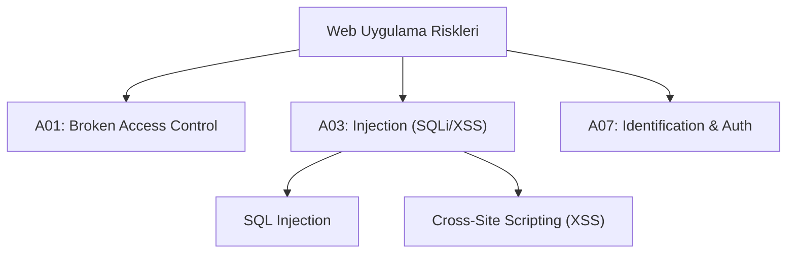

## 📌 Özet
OWASP Top 10, web uygulamaları dünyasında en sık rastlanan ve etkisi en yüksek olan on güvenlik riskini listeleyen, global ölçekte kabul görmüş bir farkındalık belgesidir. Bu liste, geliştiriciler ve güvenlik test uzmanları için kritik bir savunma rehberi görevi görür. Web uygulamaları karmaşıklaştıkça, OWASP standartlarına uyum kurumsal verilerin korunması için asgari bir gereklilik haline gelmiştir. Bu notta, listenin en kritik maddeleri ve bunlara karşı savunma stratejileri teknik detaylarıyla incelenmektedir. Güvenli kod yazımı (S-SDLC), bu zafiyetleri daha üretim aşamasına gelmeden engellemeyi amaçlar.

## 🧠 Detay

### 1. SQL Injection (SQLi)
Saldırganın veritabanı sorgularına müdahale etmesidir.
- **Savunma:** Parameterized queries (Prepared Statements).

### 2. Cross-Site Scripting (XSS)
Kullanıcı tarayıcısında zararlı JS kodu çalıştırma.
- **Savunma:** Output encoding, CSP.

### 3. Kırık Erişim Kontrolü
Kullanıcının yetkisi olmayan verilere (IDOR) erişebilmesi durumu.

## 💡 Bağlantılar
- [[Siber Güvenlik - Güvenli Kod Yazımı (SAST-DAST)]]
- [[Siber Güvenlik - API Güvenliği]]

## ❓ Sorular / Anlamadıklarım

## 🔗 Kaynaklar
- OWASP Top 10 Official Website
- PortSwigger Web Security Academy
