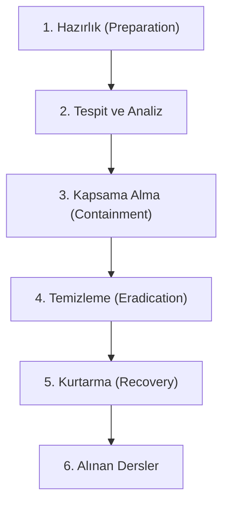

## 📌 Özet
Olay müdahalesi (Incident Response), bir siber saldırı veya veri ihlali durumunda bir organizasyonun bu durumu yönetme, etkilerini azaltma ve sistemleri normale döndürme sürecidir. Sürecin temel amacı, hasarı en aza indirmek, saldırganın içerideki kalıcılığını kırmak ve gelecekte benzer olayların yaşanmasını önlemektir. Başarılı bir operasyon; önceden hazırlanmış bir müdahale planı (IRP), uzman bir ekip (CSIRT) ve disiplinli bir metodoloji gerektirir. SANS veya NIST tarafından tanımlanan standart adımlar, kaos anında ekiplerin organize hareket etmesini sağlar. Olay müdahalesi, hem teknik bir kurtarma işlemi hem de bir kriz yönetimi disiplinidir.

## 🧠 Detay

### 1. Müdahale Aşamaları
- **Kapsama Alma:** Saldırının yayılmasını durdurmak (örn: sunucunun ağını kesmek).
- **Temizleme:** Saldırganın bıraktığı zararlıları ve arka kapıları silme.

### 2. Kritik Roller
- **SOC Analisti:** Tehdidi ilk tespit eden.
- **Incident Responder:** Müdahaleyi yöneten teknik uzman.

## 💡 Bağlantılar
- [[Siber Güvenlik - SIEM ve Log Analizi]]
- [[Siber Güvenlik - Ransomware ve Malware]]

## ❓ Sorular / Anlamadıklarım

## 🔗 Kaynaklar
- NIST SP 800-61: Incident Handling Guide
- SANS Incident Handler's Handbook
