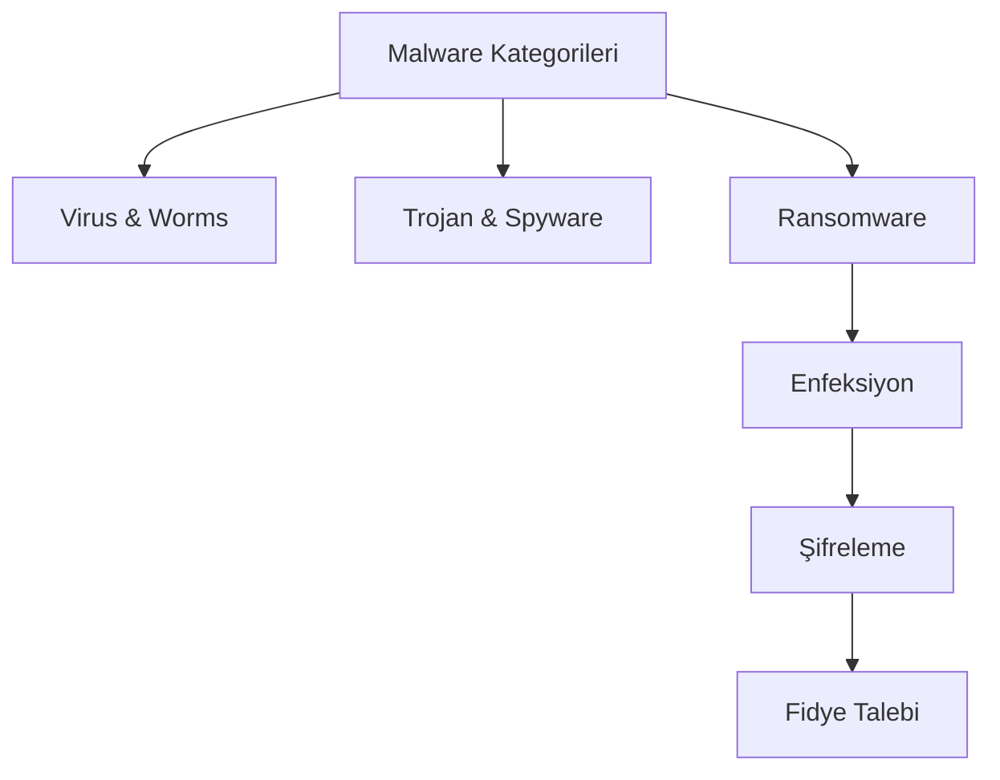

## 📌 Özet
Malware (Kötü Amaçlı Yazılım), bilgisayar sistemlerine zarar vermek, bilgi sızdırmak veya izinsiz erişim sağlamak amacıyla geliştirilmiş her türlü yazılımın genel adıdır. Virüsler, solucanlar, truva atları ve casus yazılımlar bu ailenin en bilinen üyeleridir. Son yılların en yıkıcı türü olan Ransomware (Fidye Yazılımı), kurbanın verilerini şifreleyerek erişimi engeller ve anahtar karşılığında fidye talep eder. Etkili bir koruma stratejisi; güncel yedekleme politikaları, EDR sistemleri ve çalışanların sosyal mühendisliğe karşı sürekli eğitilmesini gerektirir.

## 🧠 Detay

### 1. Kritik Malware Türleri
- **Rootkit:** İşletim sistemi çekirdeğine sızarak kendini gizler.
- **Fileless Malware:** RAM üzerinde çalışır, diske iz bırakmaz.

### 2. Analiz Yöntemleri
- **Statik Analiz:** Kodu çalıştırmadan inceleme.
- **Dinamik Analiz (Sandboxing):** İzole ortamda çalıştırıp izleme.

### 3. Savunma
3-2-1 Yedekleme kuralı ve davranışsal anomali tespiti yapan EDR kullanımı.

## 💡 Bağlantılar
- [[Siber Güvenlik - Sosyal Mühendislik ve Oltalama]]
- [[Siber Güvenlik - SIEM ve Log Analizi]]

## ❓ Sorular / Anlamadıklarım

## 🔗 Kaynaklar
- MITRE ATT&CK Framework
- Malwarebytes Labs
