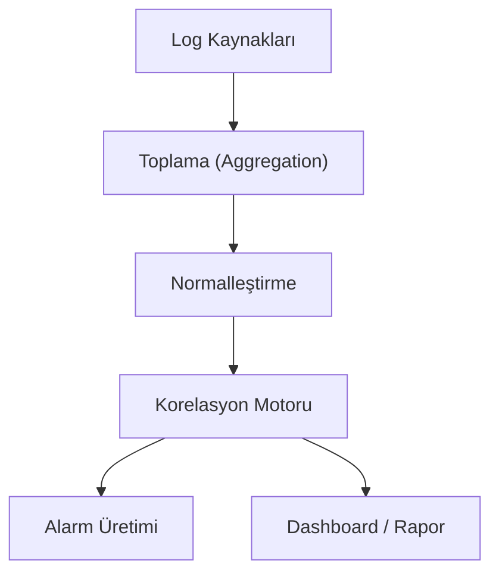

## 📌 Özet
SIEM (Security Information and Event Management), ağ ve sistem bileşenlerinden gelen güvenlik günlüklerini gerçek zamanlı olarak toplayan ve analiz eden merkezi bir yönetim sistemidir. Dağınık haldeki verileri bir araya getirerek aralarında korelasyon kurar ve potansiyel bir saldırıyı tespit ettiğinde alarm üretir. Log analizi, hem geçmişe dönük olayların nedenlerini bulmak hem de uyumluluk standartlarını karşılamak için kritiktir. Modern SOC birimlerinin temel çalışma aracı olan SIEM, tehditleri görünür hale getirerek müdahale süresini azaltır.

## 🧠 Detay

### 1. SIEM'in Fonksiyonları
- **Normalization:** Farklı formatlardaki logları tek bir standart dile çevirme.
- **Correlation:** "Aynı IP'den 1 dakikada 50 başarısız giriş" gibi kurallarla saldırı tespiti.

### 2. Popüler Araçlar
Splunk, ELK Stack (Elasticsearch), Microsoft Sentinel.

## 💡 Bağlantılar
- [[Siber Güvenlik - Olay Müdahalesi (Incident Response)]]
- [[Siber Güvenlik - Ransomware ve Malware]]

## ❓ Sorular / Anlamadıklarım

## 🔗 Kaynaklar
- Splunk Security Guide
- Elastic Security Documentation
