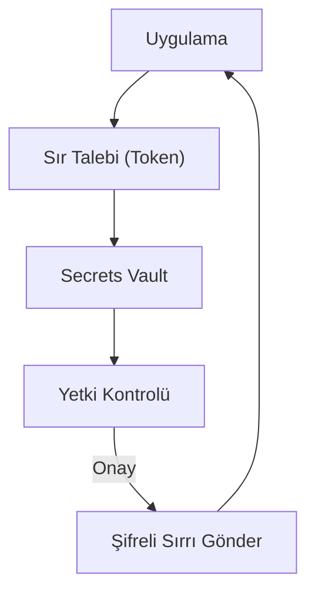

## 📌 Özet
Secrets Management (Sır Yönetimi), dijital sistemlerde kullanılan şifreler, API anahtarları ve sertifikalar gibi hassas bilgilerin güvenli bir şekilde saklanması ve yönetilmesi sürecidir. Yazılım geliştirme süreçlerinde bu sırların kaynak kodda açık metin olarak bırakılması, saldırganlar için en kolay giriş kapılarından biridir. Modern çözümler; verilerin şifreli depolanmasını, erişim denetimini ve sırların otomatik olarak döndürülmesini (rotation) sağlar. Bu disiplin, özellikle mikroservis ve bulut mimarilerinde güvenliğin temel taşıdır.

## 🧠 Detay

### 1. Temel Riskler
- **Hardcoding:** Şifrelerin koda gömülmesi.
- **Git Leakage:** `.env` dosyalarının kazara repo'ya yüklenmesi.

### 2. Çözüm Yöntemleri
- **Environment Variables:** Sırları koddan ayırma.
- **Vault Araçları:** HashiCorp Vault, AWS Secrets Manager.

## 💡 Bağlantılar
- [[Siber Güvenlik - Container ve Kubernetes Güvenliği]]
- [[Siber Güvenlik - Kimlik Doğrulama ve Yetkilendirme]]

## ❓ Sorular / Anlamadıklarım

## 🔗 Kaynaklar
- HashiCorp Vault Documentation
- OWASP Secrets Management Cheat Sheet
