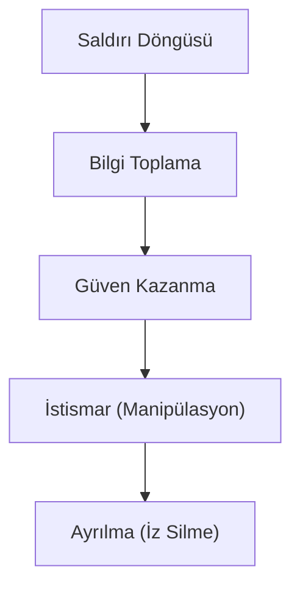

## 📌 Özet
Sosyal mühendislik, teknik bir zafiyetten ziyade insan psikolojisindeki zayıflıkları kullanarak bilgi sızdırma veya sisteme erişim sağlama sanatıdır. "İnsan, güvenlik zincirinin en zayıf halkasıdır" prensibine dayanan bu saldırılar; oltalama (phishing), yemleme ve ön metin oluşturma gibi yöntemlerle gerçekleştirilir. Teknolojik savunmalar ne kadar güçlü olursa olsun, bilinçsiz bir kullanıcının tek bir hatası tüm güvenliği tehlikeye atabilir. Bu notta, manipülasyon teknikleri ve farkındalık temelli savunma stratejileri incelenmektedir.

## 🧠 Detay

### 1. Yaygın Teknikler
- **Spear Phishing:** Belirli bir kişiye yönelik hedefli saldırı.
- **Pretexting:** Sahte bir senaryo ile kurbanı ikna etme.
- **Baiting:** Zararlı içeren USB gibi cihazları açıkta bırakma.

### 2. Savunma
Sürekli eğitim, oltalama simülasyonları ve e-posta güvenlik protokolleri (SPF/DKIM).

## 💡 Bağlantılar
- [[Siber Güvenlik - Giriş ve Temel Kavramlar (CIA, Threat Model)]]
- [[Siber Güvenlik - Kimlik Doğrulama ve Yetkilendirme]]

## ❓ Sorular / Anlamadıklarım

## 🔗 Kaynaklar
- Hadnagy - Social Engineering: The Art of Human Hacking
- SANS Security Awareness Training
