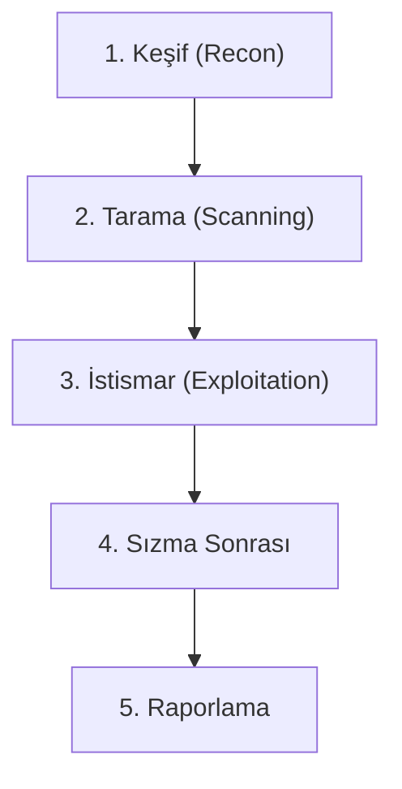

## 📌 Özet
Sızma testi (Penetration Testing), bir sistemin güvenliğini değerlendirmek amacıyla yapılan yasal ve kontrollü bir saldırı simülasyonudur. Bu süreç, sadece zafiyetleri bulmakla kalmaz, aynı zamanda bu zafiyetlerin gerçek dünyada nasıl suistimal edilebileceğini kanıtlar. Standart bir metodoloji (PTES gibi) izlemek, testin kapsamlı ve tekrarlanabilir olmasını sağlar. Testler genellikle keşif, tarama, istismar ve raporlama adımlarından oluşur. Kurumların güvenlik haritasını çıkararak riskleri önceliklendirmelerine yardımcı olur.

## 🧠 Detay

### 1. Pentest Türleri
- **Black Box:** Hedef hakkında bilgi verilmez.
- **White Box:** Tüm sistem bilgileri paylaşılır.
- **Grey Box:** Kısıtlı bilgi verilir.

### 2. Araçlar
Metasploit, Burp Suite, Nmap, Cobalt Strike.

## 💡 Bağlantılar
- [[Siber Güvenlik - Güvenlik Açığı Tarama (Nmap, Nessus)]]
- [[Siber Güvenlik - OWASP Top 10 (SQLi, XSS, CSRF)]]

## ❓ Sorular / Anlamadıklarım

## 🔗 Kaynaklar
- PTES Execution Standard
- Offensive Security (OSCP) Syllabus
