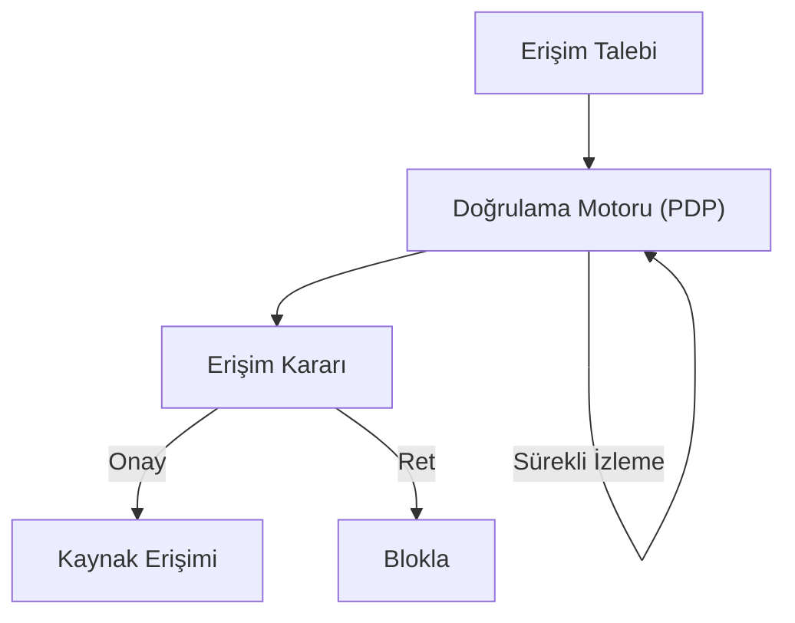

## 📌 Özet
Sıfır Güven (Zero Trust), "Asla güvenme, her zaman doğrula" prensibine dayanan modern bir siber güvenlik stratejisidir. Geleneksel yaklaşımların aksine, Zero Trust; ağın içindeki veya dışındaki her kullanıcının ve cihazın her erişim talebinde sürekli olarak doğrulanması gerektiğini savunur. Kimlik, konum ve cihaz sağlığı gibi çoklu veriler üzerinden risk bazlı kararlar alınır. Bu mimari, kurumsal sınırların ortadan kalktığı bulut ve uzaktan çalışma dünyasında bir zorunluluk haline gelmiştir.

## 🧠 Detay

### 1. Temel İlkeler
- **Least Privilege:** Sadece gereken yetkiyi ver.
- **Micro-segmentation:** Ağı küçük, izole parçalara böl.
- **Continuous Monitoring:** Oturum süresince güvenliği denetle.

### 2. Uygulama
Identity Providers (IDP), MFA ve Next-Gen Firewall entegrasyonu ile hayata geçirilir.

## 💡 Bağlantılar
- [[Siber Güvenlik - Kimlik Doğrulama ve Yetkilendirme]]
- [[Siber Güvenlik - Ağ Güvenliği Temelleri (TCP-IP, Firewall, VPN)]]

## ❓ Sorular / Anlamadıklarım

## 🔗 Kaynaklar
- Google BeyondCorp Architecture
- Microsoft Zero Trust Deployment Center
