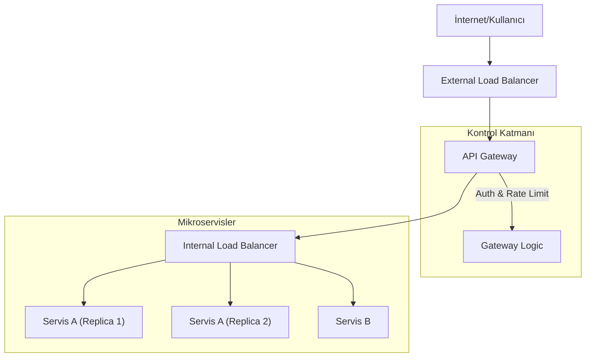

## 📌 Özet
API Gateway ve Load Balancer, modern sistem tasarımında dış dünyadan gelen isteklerin yönetildiği kritik giriş noktalarıdır. Load Balancer, gelen trafiği birden fazla sunucu arasında dağıtarak sistemin yüksek erişilebilirliğini ve performansını korurken; API Gateway, mikroservis mimarilerinde merkezi bir yönetim katmanı olarak görev yapar. Gateway; kimlik doğrulama, istek yönlendirme, rate limiting ve protokol dönüşümü gibi görevleri üstlenerek backend servislerinin karmaşıklığını gizler. Her iki bileşen de tek hata noktası (Single Point of Failure) olma riski taşıdığından, yedekli (redundant) yapılarla tasarlanmalıdır. Bu not, bu iki kavramın farklarını, kullanım senaryolarını ve trafik yönetimi algoritmalarını inceler.

## 🧠 Detay

### 1. Load Balancing (Yük Dengeleme)
Trafiği mevcut kaynaklar arasında paylaştırma işlemidir.

- **Algoritmalar:**
    - **Round Robin:** Sırayla her sunucuya bir istek gönderir.
    - **Least Connections:** O an en az aktif bağlantısı olan sunucuyu seçer.
    - **IP Hash:** Kullanıcının IP adresine göre hep aynı sunucuya gitmesini sağlar (Session stickiness).
- **Türler:**
    - **Layer 4 (L4):** TCP/UDP seviyesinde, IP ve Port bilgisine göre yönlendirme yapar (Hızlıdır).
    - **Layer 7 (L7):** Uygulama seviyesinde, URL, Header veya Cookie içeriğine göre yönlendirme yapar (Akıllıdır).

### 2. API Gateway
İstemciler ile mikroservisler arasında bir ters vekil (reverse proxy) sunucusudur.

- **Görevleri:**
    - **Routing:** İsteği doğru mikroservise yönlendirir.
    - **Authentication/Authorization:** Token kontrolünü merkezi olarak yapar.
    - **Rate Limiting:** Belirli bir IP veya kullanıcıdan gelen istek sayısını kısıtlar.
    - **BFF (Backend for Frontend):** Farklı cihaz türleri (Mobil, Web) için özelleştirilmiş API uçları sunar.

### 3. Karşılaştırma
| Özellik | Load Balancer | API Gateway |
| :--- | :--- | :--- |
| **Temel Odak** | Trafik dağıtımı ve yüksek erişilebilirlik | API yönetimi, güvenlik ve orkestrasyon |
| **Seviye** | Genellikle L4 veya L7 | Daima L7 (Uygulama katmanı) |
| **Yetenek** | Sağlık kontrolü (Health checks), SSL offloading | Transformation, Logging, Auth, Aggregation |

### 4. Service Mesh ile İlişki
Çok karmaşık sistemlerde, servisler arası iletişim (East-West traffic) için API Gateway yerine **Service Mesh** (Örn: Istio, Linkerd) tercih edilebilir. API Gateway daha çok dış dünya ile olan iletişim (North-South traffic) için kullanılır.

## 💡 Bağlantılar
- [[SD - Mimari Giriş ve Monolith vs Microservices]]
- [[SD - Ölçeklenebilirlik (Horizontal vs Vertical Scaling)]]
- [[SD - Caching Stratejileri (Redis, Memcached)]]
