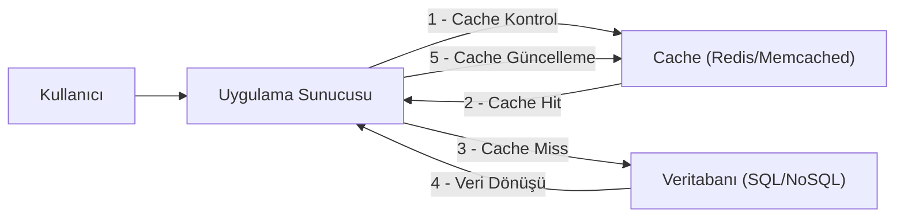

## 📌 Özet
Önbellekleme (Caching), sık erişilen verilerin daha hızlı erişilebilen geçici bir depolama katmanında (genellikle RAM) saklanması işlemidir. Bu strateji, ana veritabanı üzerindeki yükü azaltır, uygulama yanıt sürelerini (latency) düşürür ve sistemin genel ölçeklenebilirliğini artırır. Redis ve Memcached, bu alandaki en popüler iki teknolojidir; Redis zengin veri yapıları ve kalıcılık sunarken, Memcached basitliği ve yüksek hızıyla bilinir. Doğru caching stratejisini seçmek, veri tutarlılığı ile performans arasındaki dengeyi kurmak açısından kritiktir. Bu not, yaygın caching desenlerini ve karşılaşılan temel sorunları ele almaktadır.

## 🧠 Detay

### 1. Caching Stratejileri (Read/Write Patterns)
- **Cache-Aside (Lazy Loading):** Uygulama önce cache'e bakar. Veri yoksa (miss) DB'den okur ve cache'e yazar. En yaygın kullanılan yöntemdir.
- **Read-Through:** Uygulama sadece cache ile konuşur. Cache, veri yoksa DB'den kendisi çeker ve istemciye döner.
- **Write-Through:** Veri önce cache'e, sonra hemen DB'ye yazılır. Veri tutarlılığı yüksektir ancak yazma hızı yavaştır.
- **Write-Behind (Write-Back):** Veri önce cache'e yazılır, DB güncellemesi asenkron olarak daha sonra yapılır. Yazma performansı çok yüksektir ama veri kaybı riski vardır.

### 2. Redis vs Memcached
| Özellik | Memcached | Redis |
| :--- | :--- | :--- |
| **Veri Yapıları** | Sadece String | List, Set, Hash, Sorted Set, Bitmaps |
| **Kalıcılık (Persistence)** | Yok | Var (RDB, AOF) |
| **Ölçekleme** | Yatay (Multithreaded) | Master-Slave, Sentinel, Cluster |
| **Kullanım Senaryosu** | Basit anahtar-değer ihtiyaçları | Karmaşık veri işleme, Message Broker |

### 3. Kritik Cache Problemleri
- **Cache Penetration:** Cache'de ve DB'de olmayan verilerin sürekli sorgulanması (Bloom Filter ile çözülür).
- **Cache Avalanche (Çığı):** Çok sayıda cache anahtarının aynı anda expire olması (TTL değerlerine rastgelelik ekleyerek çözülür).
- **Cache Stampeding:** Popüler bir anahtar expire olduğunda, tüm uygulama örneklerinin aynı anda DB'ye yüklenmesi (Locking veya soft-TTL ile çözülür).

### 4. Tahliye Politikaları (Eviction Policies)
Cache dolduğunda hangi verinin silineceğine karar verir:
- **LRU (Least Recently Used):** En uzun süredir kullanılmayan.
- **LFU (Least Frequently Used):** En az sıklıkta kullanılan.
- **FIFO (First In First Out):** İlk giren ilk çıkar.

## 💡 Bağlantılar
- [[SD - Dağıtık Sistemler ve CAP Teoremi]]
- [[SD - API Gateway ve Load Balancing]]
- [[SD - Ölçeklenebilirlik (Horizontal vs Vertical Scaling)]]
