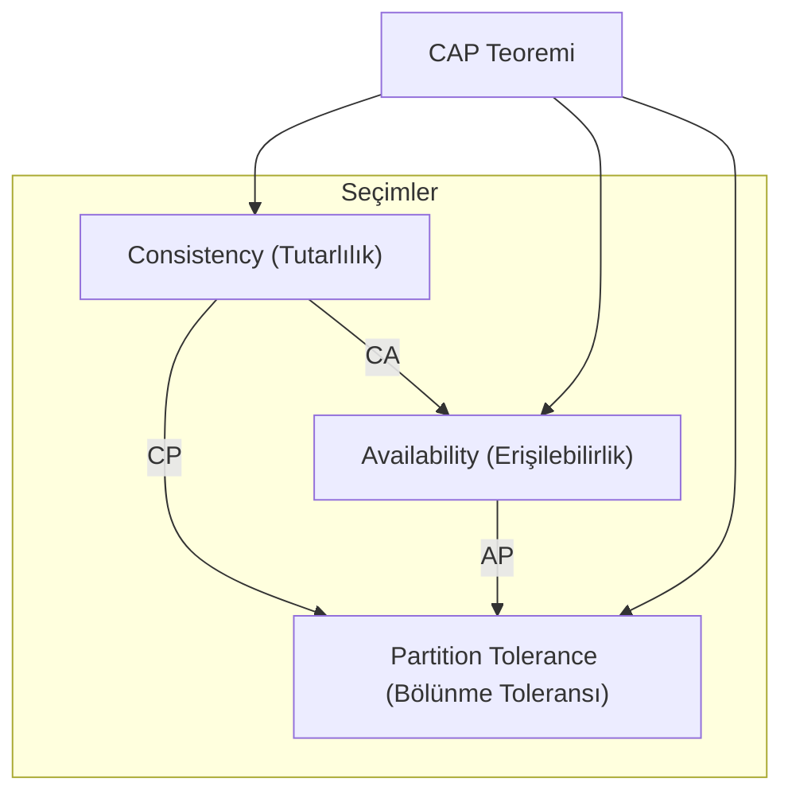

## 📌 Özet
Dağıtık sistemler, birden fazla bilgisayarın bir ağ üzerinden birbirleriyle iletişim kurarak ortak bir hedef için çalıştığı yapılardır. Eric Brewer tarafından ortaya atılan CAP Teoremi, bir dağıtık veri deposunun aynı anda şu üç özellikten sadece ikisini sağlayabileceğini belirtir: Tutarlılık (Consistency), Erişilebilirlik (Availability) ve Bölünme Toleransı (Partition Tolerance). Gerçek dünya ağlarında "bölünme" (P) her zaman bir risk olduğundan, mimarlar genellikle Tutarlılık (C) ile Erişilebilirlik (A) arasında bir seçim yapmak zorunda kalır. Bu teorem, modern veritabanlarının (NoSQL vs SQL) neden farklı davranışlar sergilediğini anlamak için temel bir rehberdir. Bu not, CAP bileşenlerini ve modern sistem tasarımlarındaki pratik uygulamalarını derinlemesine inceler.

## 🧠 Detay

### 1. CAP Bileşenleri
- **Consistency (Tutarlılık):** Her okuma isteği, en son yazılan veriyi ya da bir hata döndürür. Tüm düğümler aynı anda aynı veriyi görür.
- **Availability (Erişilebilirlik):** Her istek (başarılı/başarısız) bir yanıt alır, ancak yanıtın en güncel veri olacağı garanti edilmez.
- **Partition Tolerance (Bölünme Toleransı):** Ağdaki düğümler arası iletişim kopsa bile (network partition) sistem çalışmaya devam eder.

### 2. P (Bölünme) Kaçınılmazdır
Dağıtık bir sistemde ağ hataları kaçınılmaz olduğu için **P** özelliğinden vazgeçmek, sistemi "dağıtık olmayan" (tek bir sunucu) hale getirmek demektir. Bu nedenle seçimler şunlardır:
- **CP (Tutarlılık + Bölünme Toleransı):** Ağ bölünmesi olduğunda, verinin tutarlılığını korumak için bazı düğümler isteklere yanıt vermeyi durdurur (Erişilebilirlik feda edilir). Örn: HBase, MongoDB (default), Redis.
- **AP (Erişilebilirlik + Bölünme Toleransı):** Ağ bölünmesi olsa da düğümler yanıt vermeye devam eder, ancak farklı düğümler farklı veri döndürebilir (Tutarlılık feda edilir). Örn: Cassandra, DynamoDB, CouchDB.

### 3. PACELC: CAP'in Ötesi
CAP sadece bölünme anındaki durumu açıklar. **PACELC** ise normal çalışma anındaki (bölünme yokken) trade-off'u da ekler: "If **P**artition, **A**vailability or **C**onsistency; **E**lse (normalde), **L**atency or **C**onsistency."

### 4. Mimari Karar Stratejisi
- Finansal sistemler gibi veri doğruluğunun kritik olduğu yerlerde **CP** tercih edilir.
- Sosyal medya feed'leri veya alışveriş sepetleri gibi sistemin her zaman açık olması gereken yerlerde **AP** (Eventual Consistency ile) tercih edilir.

## 💡 Bağlantılar
- [[SD - Veritabanı Seçim Stratejileri (SQL vs NoSQL)]]
- [[SD - Event-Driven Mimari ve Mesaj Kuyrukları]]
- [[SD - Dağıtık Sistemler ve CAP Teoremi]]
