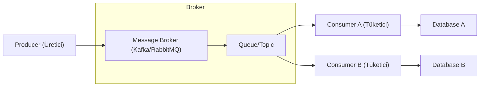

## 📌 Özet
Event-Driven Mimari (EDA), sistem bileşenlerinin durum değişikliklerini (olay/event) yayınlayarak ve bu olaylara tepki vererek etkileşime girdiği bir tasarım yaklaşımıdır. Geleneksel istek-yanıt (request-response) modelinin aksine, bileşener birbirine sıkı sıkıya bağlı değildir; bu da sistemin esnekliğini ve ölçeklenebilirliğini artırır. Mesaj kuyrukları (RabbitMQ) ve olay akış platformları (Apache Kafka), bu mimarinin bel kemiğini oluşturarak asenkron iletişimi ve veri dayanıklılığını sağlar. EDA, özellikle yüksek trafikli sistemlerde yükü zamana yaymak ve servisler arası bağımlılığı minimize etmek için tercih edilir. Bu not, EDA'nın temel bileşenlerini, avantajlarını ve "eventual consistency" (nihai tutarlılık) gibi zorluklarını analiz eder.

## 🧠 Detay

### 1. Temel Kavramlar
- **Event (Olay):** Sistemin bir parçasında gerçekleşen önemli bir durum değişikliğidir (Örn: "Sipariş oluşturuldu").
- **Producer (Publisher):** Olayı oluşturan ve broker'a gönderen servistir.
- **Consumer (Subscriber):** Belirli olayları dinleyen ve onlara göre işlem yapan servistir.
- **Message Broker:** Mesajları ileten, saklayan ve yönlendiren ara katmandır.

### 2. Mesajlaşma Modelleri
- **Point-to-Point (Queue):** Mesaj bir kuyruğa girer ve sadece bir tüketici tarafından işlenir. (Örn: E-posta gönderim kuyruğu).
- **Publish/Subscribe (Topic):** Mesaj bir başlığa yayınlanır ve o başlığı dinleyen tüm tüketicilere iletilir. (Örn: Stok güncelleme bilgisinin hem kargo hem de muhasebe servisine gitmesi).

### 3. Kullanılan Teknolojiler
- **RabbitMQ:** Geleneksel mesaj kuyruğu. Karmaşık yönlendirme (routing) kuralları ve anlık mesaj iletimi için idealdir.
- **Apache Kafka:** Yüksek hacimli veri akışları için optimize edilmiş, olayları diskte saklayan (persistent) bir platformdur. "Replayability" (olayları yeniden oynatma) özelliği sunar.

### 4. Avantajlar ve Zorluklar
- **Avantajlar:**
    - **Loose Coupling:** Servisler birbirinin varlığından haberdar olmak zorunda değildir.
    - **Scalability:** Tüketici sayısı artırılarak işlem kapasitesi yatayda kolayca büyütülebilir.
    - **Resilience:** Bir servis çöktüğünde mesajlar broker'da bekler, servis ayağa kalktığında işlenmeye devam eder.
- **Zorluklar:**
    - **Eventual Consistency:** Verinin tüm sistemlerde aynı anda güncel olmaması.
    - **Debugging:** Takibi zor asenkron akışlar.
    - **At-least-once Delivery:** Aynı mesajın birden fazla kez işlenmesi riskine karşı **Idempotency** (bir işlemin defalarca yapılsa da aynı sonucu vermesi) tasarımı şarttır.

## 💡 Bağlantılar
- [[SD - Dağıtık Sistemler ve CAP Teoremi]]
- [[SD - Caching Stratejileri (Redis, Memcached)]]
- [[SD - Mimari Giriş ve Monolith vs Microservices]]
