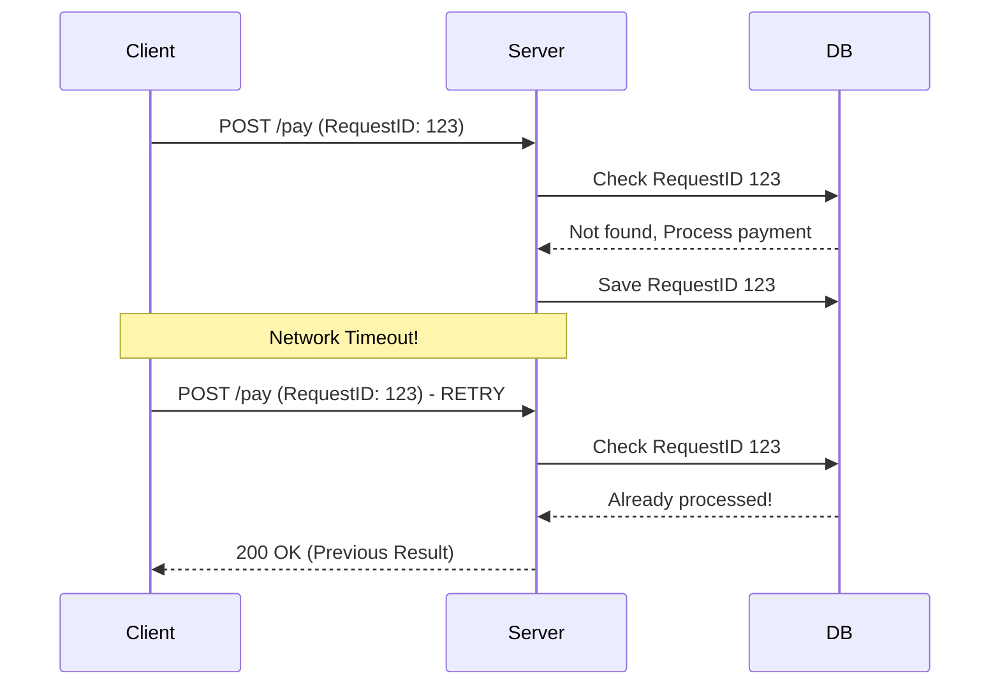

## 📌 Ozet
Idempotency (Birimlik), bir işlemin birden çok kez tekrarlanması durumunda sonucun değişmemesi özelliğidir. Dağıtık sistemlerde ağ hataları nedeniyle isteklerin tekrar gönderilmesi (Retry) kaçınılmazdır. Idempotency, bu tekrarların veritabanında çift kayıt veya yanlış işlem yapmasını önler.

## 🧠 Detay

### 1. Retry Stratejileri
- **Exponential Backoff:** Her deneme arasındaki bekleme süresini artırır (1s, 2s, 4s...).
- **Jitter:** Çakışmaları önlemek için bekleme süresine rastgelelik ekler.

### 2. Idempotency Nasıl Sağlanır?
- **Idempotency Key:** Her istek için benzersiz bir anahtar kullanılır (Client tarafından oluşturulur).
- **Database Constraints:** Benzersiz indeksler (Unique constraints) ile çift kayıt engellenir.

## 💡 Baglantilar
- [[SD - Event-Driven Mimari ve Mesaj Kuyrukları]]
- [[API - FastAPI Hata Yönetimi]]
