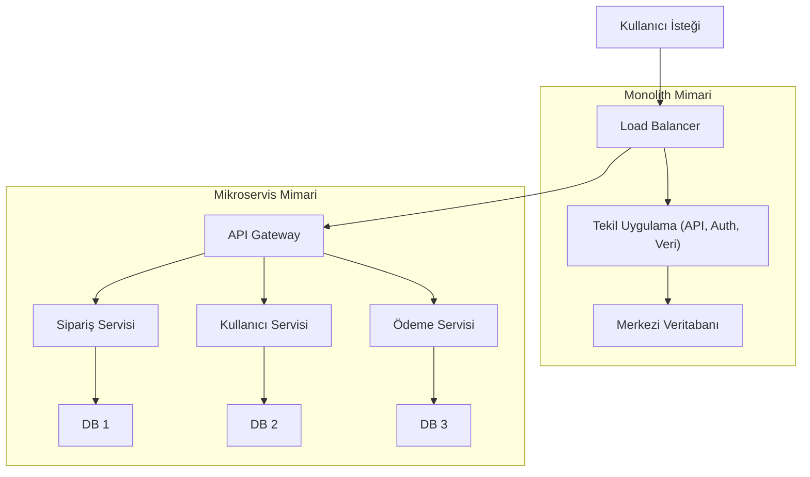

## 📌 Özet
Yazılım mimarisi, bir sistemin temel bileşenlerini ve bu bileşenler arasındaki ilişkileri tanımlayan stratejik bir disiplindir. Geleneksel monolitik mimari, tüm işlevlerin tek bir kod tabanı ve dağıtım birimi içinde toplandığı yapıyı temsil ederken; mikroservisler sistemi bağımsız, ölçeklenebilir ve belirli iş odaklı servisler kümesine böler. Monolith başlangıç aşamasında hız ve basitlik sağlarken, sistem karmaşıklaştıkça mikroservislerin sunduğu teknolojik esneklik ve bağımsız hata izolasyonu kritik hale gelir. Doğru mimari seçimi, sadece teknik değil, aynı zamanda organizasyonel yapı ve operasyonel maliyetler gözetilerek yapılmalıdır. Bu not, her iki yaklaşımın avantajlarını, dezavantajlarını ve geçiş stratejilerini kapsamlı bir şekilde ele almaktadır.

## 🧠 Detay

### 1. Monolith Mimari (Tekil Yapı)
Monolith, tüm yazılım katmanlarının (UI, Business Logic, Data Access) tek bir uygulama içinde barındırıldığı yapıdır.

- **Avantajlar:**
    - Geliştirme ve test süreçleri başlangıçta daha basittir.
    - Deployment (dağıtım) tek bir birim üzerinden yapılır.
    - Servisler arası iletişim maliyeti (network latency) yoktur.
- **Dezavantajlar:**
    - **Tight Coupling:** Bir modüldeki hata tüm sistemi çökertebilir.
    - **Ölçekleme Zorluğu:** Sadece yoğunluk olan kısım değil, tüm uygulama ölçeklenmek zorundadır.
    - **Teknoloji Bağımlılığı:** Tüm sistem aynı teknoloji yığınına mahkumdur.

### 2. Mikroservis Mimari
Sistemi, her biri belirli bir iş yeteneğini temsil eden, bağımsız olarak dağıtilebilir servislere ayırır.

- **Temel Prensipler:**
    - **Single Responsibility:** Her servis tek bir işten sorumludur.
    - **Database per Service:** Her servisin kendi veritabanı olması veri izolasyonunu sağlar.
    - **Decentralization:** Karar verme ve teknoloji seçimi servis bazında yapılır.
- **Trade-offs (Ödünleşimler):**
    - **Operasyonel Karmaşıklık:** Monitoring, logging ve deployment süreçleri daha karmaşıktır.
    - **Veri Tutarlılığı:** Distributed transactions (dağıtık işlemler) yerine Eventual Consistency (nihai tutarlılık) benimsenmelidir.

### 3. Mimari Karar Matrisi
| Özellik | Monolith | Microservices |
| :--- | :--- | :--- |
| **Geliştirme Hızı** | Başlangıçta hızlı | Başlangıçta yavaş, uzun vadede sürdürülebilir |
| **Ölçeklenebilirlik** | Dikey (Vertical) | Yatay (Horizontal) |
| **Hata İzolasyonu** | Düşük | Yüksek |
| **Dağıtım** | Kolay | Zor (Otomasyon şart) |

## 💡 Bağlantılar
- [[SD - API Gateway ve Load Balancing]]
- [[SD - Veritabanı Seçim Stratejileri (SQL vs NoSQL)]]
- [[SD - Ölçeklenebilirlik (Horizontal vs Vertical Scaling)]]
