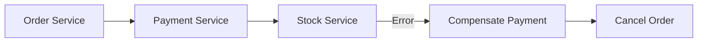

## 📌 Ozet
Mikroservis mimarilerinde veritabanları ayrık olduğu için geleneksel ACID transactionları (2PC) ölçeklenemez. Saga Pattern, dağıtık bir transactionı her biri yerel bir transaction olan küçük adımlara böler. Eğer bir adım hata alırsa, önceki adımları geri almak için "Compensating Transactions" (Telafi İşlemleri) çalıştırılır.

## 🧠 Detay

### 1. Saga Türleri
- **Choreography:** Her servis bir event fırlatır ve diğerleri bunu dinler (Merkezi kontrol yok).
- **Orchestration:** Merkezi bir "Orchestrator" hangi adımın ne zaman çalışacağını yönetir.

### 2. Avantaj ve Dezavantaj
- **Avantaj:** Yüksek ölçeklenebilirlik, servisler arası düşük bağımlılık.
- **Dezavantaj:** Karmaşık hata yönetimi, "Eventual Consistency" (Nihai Tutarlılık).

## 💡 Baglantilar
- [[SD - Mimari Giriş ve Monolith vs Microservices]]
- [[DB - CAP Teoremi ve PACELC]]
