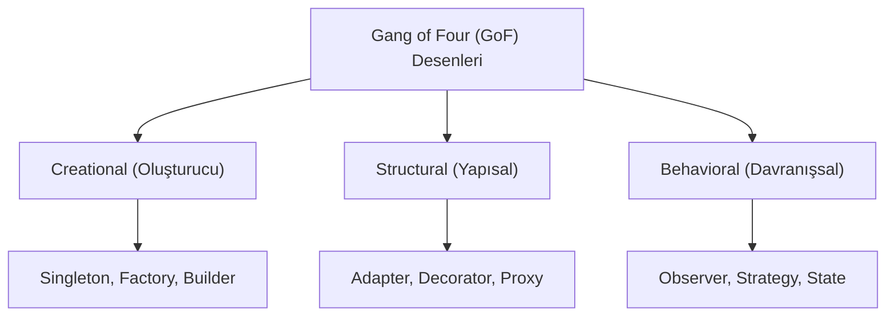

## 📌 Özet
Tasarım desenleri, yazılım geliştirmede sık karşılaşılan problemlere getirilen standart ve tekrar kullanılabilir çözüm şablonlarıdır. Erich Gamma, Richard Helm, Ralph Johnson ve John Vlissides (Gang of Four) tarafından sistemleştirilen bu desenler; nesne yönelimli programlamada esneklik, sürdürülebilirlik ve kod okunabilirliğini artırmayı hedefler. Desenler; Nesne Oluşturma (Creational), Yapısal (Structural) ve Davranışsal (Behavioral) olmak üzere üç ana kategoriye ayrılır. Bu desenleri bilmek, "tekerleği yeniden icat etmeyi" önler ve yazılımcılar arasında ortak bir teknik dil oluşturur. Bu not, en kritik desenleri ve bunların mimari etkilerini incelemektedir.

## 🧠 Detay

### 1. Creational Patterns (Oluşturucu Desenler)
Nesnelerin nasıl oluşturulacağına odaklanarak, oluşturma mantığını istemciden gizlerler.

- **Singleton:** Bir sınıftan sadece bir örneğin (instance) oluşturulmasını garanti eder. Veritabanı bağlantı havuzları veya logger mekanizmaları için yaygındır.
- **Factory Method:** Nesne oluşturma sorumluluğunu alt sınıflara bırakır. Hangi nesnenin oluşturulacağı runtime'da (çalışma zamanı) belirlenir.
- **Builder:** Karmaşık nesnelerin adım adım inşa edilmesini sağlar. Özellikle çok parametreli kurucu metodların (telescoping constructor) önüne geçer.

### 2. Structural Patterns (Yapısal Desenler)
Sınıfların ve nesnelerin bir araya gelerek daha büyük yapılar oluşturmasını sağlar.

- **Adapter:** Bir sınıfın arayüzünü (interface), istemcinin beklediği başka bir arayüze dönüştürür. Uyumsuz yapıları bir arada çalıştırır.
- **Decorator:** Nesnelere, yapılarını değiştirmeden dinamik olarak yeni sorumluluklar ekler. Kalıtım yerine kompozisyonu (composition) tercih eder.
- **Proxy:** Bir nesneye erişimi kontrol etmek için vekil bir nesne sunar. Cacheleme veya yetkilendirme katmanları için idealdir.

### 3. Behavioral Patterns (Davranışsal Desenler)
Nesneler arasındaki iletişim ve sorumluluk dağılımına odaklanır.

- **Observer:** Bir nesnenin durumunda değişiklik olduğunda, ona bağlı olan diğer nesnelerin otomatik olarak haberdar edilmesini sağlar (Pub/Sub mantığı).
- **Strategy:** Bir algoritma ailesini tanımlar, her birini kapsülleyip birbirlerinin yerine kullanılabilir hale getirir.
- **Command:** Bir isteği bir nesne olarak kapsüller, böylece kullanıcıları farklı isteklerle parametreize etmeye ve geri alma (undo) işlemlerine olanak tanır.

### Mimari Trade-offs
Tasarım desenleri kodun esnekliğini artırsa da, gereksiz kullanımı **Overengineering**'e yol açarak sistem karmaşıklığını artırabilir. Basit bir çözüm yeterliyken desen kullanmak, kodun takip edilmesini zorlaştırabilir.

## 💡 Bağlantılar
- [[SD - Dağıtık Sistemler ve CAP Teoremi]]
- [[SD - Mimari Giriş ve Monolith vs Microservices]]
