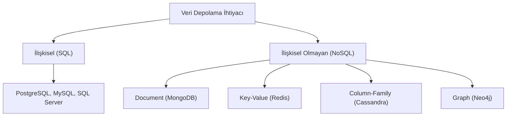

## 📌 Özet
Veritabanı seçimi, bir uygulamanın performansı, ölçeklenebilirliği ve veri bütünlüğü üzerinde belirleyici bir etkiye sahiptir. Geleneksel İlişkisel Veritabanları (SQL), katı şemaları ve ACID özellikleri ile karmaşık sorgular ve yüksek veri tutarlılığı gerektiren durumlar için idealdir. NoSQL veritabanları ise esnek şema yapıları ve yatay ölçekleme yetenekleri ile büyük veri (big data) ve hızlı değişen veri modelleri için tasarlanmıştır. Modern mimarilerde genellikle tek bir veritabanı yerine, ihtiyaca göre birden fazla veritabanı türünün bir arada kullanıldığı **Polyglot Persistence** yaklaşımı benimsenir. Bu not, SQL ve NoSQL arasındaki temel farkları, veri modelleme stratejilerini ve kullanım örneklerini detaylandırır.

## 🧠 Detay

### 1. SQL: İlişkisel Veritabanları
Verileri satır ve sütunlardan oluşan tablolarda saklar.
- **Özellikler:**
    - **ACID Uyumu:** Atomicity, Consistency, Isolation, Durability garantisi.
    - **Structured Data:** Önceden tanımlanmış katı şemalar.
    - **Vertical Scaling:** Genelde donanım artırımı ile ölçeklenir.
- **Kullanım:** Finansal işlemler, ERP sistemleri, karmaşık Join işlemleri gerektiren raporlamalar.

### 2. NoSQL: İlişkisel Olmayan Veritabanları
Farklı veri modelleri (doküman, anahtar-değer, vb.) kullanır.
- **Türler ve Örnekler:**
    - **Document:** JSON benzeri dokümanlar (MongoDB). Kataloglar ve içerik yönetimi için.
    - **Key-Value:** En basit ve hızlı model (Redis, DynamoDB). Session yönetimi ve cache için.
    - **Wide Column:** Değişken sütun yapıları (Cassandra, HBase). Zaman serisi verileri ve loglar için.
    - **Graph:** İlişki odaklı veri (Neo4j). Sosyal ağlar ve dolandırıcılık tespiti için.
- **Özellikler:**
    - **Horizontal Scaling:** Birçok ucuz sunucuya veri dağıtılarak ölçeklenir.
    - **BASE Modeli:** Basically Available, Soft state, Eventual consistency (ACID yerine).

### 3. Seçim Kriterleri
| Kriter | SQL | NoSQL |
| :--- | :--- | :--- |
| **Veri Yapısı** | Düzenli ve İlişkisel | Düzensiz veya Dinamik |
| **Ölçekleme** | Dikey (Zordur) | Yatay (Kolaydır) |
| **İşlem Tipi** | OLTP (Online Transactional) | Big Data, Real-time feeds |
| **Tutarlılık** | Strong Consistency | Eventual Consistency (Genellikle) |

### 4. Polyglot Persistence
Günümüzde "her şeye uyan tek bir ayakkabı" yoktur. Bir e-ticaret uygulamasında:
- Kullanıcı ve Sipariş bilgileri **PostgreSQL**'de (SQL),
- Ürün katalogu ve yorumlar **MongoDB**'de (Document),
- Sepet bilgileri ve oturumlar **Redis**'te (Key-Value),
- Tavsiye motoru verileri **Neo4j**'de (Graph) tutulabilir.

## 💡 Bağlantılar
- [[SD - Dağıtık Sistemler ve CAP Teoremi]]
- [[SD - Caching Stratejileri (Redis, Memcached)]]
- [[SD - Mimari Giriş ve Monolith vs Microservices]]
