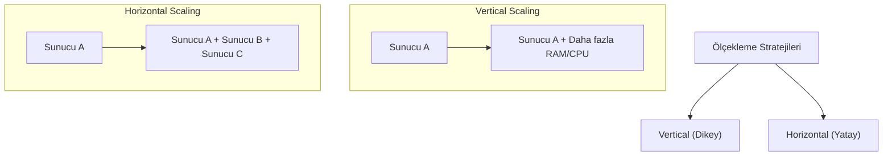

## 📌 Özet
Ölçeklenebilirlik, bir sistemin artan iş yükünü (trafik, veri hacmi, kullanıcı sayısı) mevcut kaynaklarını artırarak karşılama yeteneğidir. Dikey ölçekleme (Vertical Scaling), mevcut bir sunucunun CPU, RAM veya disk gibi donanım kapasitesini artırmayı ifade ederken; yatay ölçekleme (Horizontal Scaling), sisteme yeni sunucular ekleyerek yükü paylaştırmayı hedefler. Dikey ölçekleme başlangıçta kolay olsa da fiziksel bir üst sınıra sahiptir. Yatay ölçekleme ise teorik olarak sınırsız büyüme imkanı sunar ancak dağıtık sistem karmaşıklığını ve yük dengeleme (load balancing) ihtiyacını beraberinde getirir. Bu not, her iki yöntemin maliyet, performans ve mimari etkilerini karşılaştırmalı olarak sunmaktadır.

## 🧠 Detay

### 1. Vertical Scaling (Scaling Up)
Tek bir makinenin gücünü artırmaktır.

- **Avantajlar:**
    - Uygulama değişikliği gerektirmez (Basittir).
    - Servisler arası iletişim maliyeti (network gecikmesi) yoktur.
    - Veri yönetimi tek bir noktada olduğu için kolaydır.
- **Dezavantajlar:**
    - **Physical Limit:** Donanımın kapasitesi bittiğinde sistem daha fazla büyüyemez.
    - **Single Point of Failure:** Sunucu çökerse tüm sistem durur.
    - **Downtime:** Genellikle donanım yükseltmesi sırasında sistemin kapatılması gerekir.

### 2. Horizontal Scaling (Scaling Out)
Sisteme daha fazla makine ekleyerek kapasiteyi artırmaktır.

- **Avantajlar:**
    - **Theoretical Infinity:** İhtiyaç duyuldukça yeni sunucular eklenebilir.
    - **Fault Tolerance:** Bir sunucu çökerse trafik diğerlerine yönlendirilir.
    - **Cost-Effective:** Pahalı bir süper-sunucu yerine birçok ucuz "commodity" sunucu kullanılabilir.
- **Dezavantajlar:**
    - **Complexity:** Yük dengeleyici (Load Balancer) ve servis keşfi (Service Discovery) gerektirir.
    - **Data Consistency:** Verinin birden fazla sunucu arasında senkronize edilmesi zordur.
    - **Statelessness:** Uygulamanın "stateless" (durumsuz) tasarlanması şarttır.

### 3. Karşılaştırma Matrisi
| Özellik | Vertical Scaling | Horizontal Scaling |
| :--- | :--- | :--- |
| **Yük Devretme** | Sunucu çökerse sistem durur | Yüksek erişilebilirlik (High Availability) |
| **Ölçekleme Limiti** | Donanım sınırı | Sınırsız |
| **Maliyet** | Üstel artış (Pahalı donanım) | Lineer artış (Ucuz donanım) |
| **Bakım** | Kolay | Zor (Otomasyon/Orkestrasyon gerekir) |

### 4. AKF Scale Cube
Ölçeklenebilirliği üç boyutta ele alan model:
- **X-Axis:** Yatay ölçekleme (Replication).
- **Y-Axis:** Fonksiyonel ayrıştırma (Microservices).
- **Z-Axis:** Veri bölümleme (Sharding/Partitioning).

## 💡 Bağlantılar
- [[SD - Mimari Giriş ve Monolith vs Microservices]]
- [[SD - API Gateway ve Load Balancing]]
- [[SD - Dağıtık Sistemler ve CAP Teoremi]]
