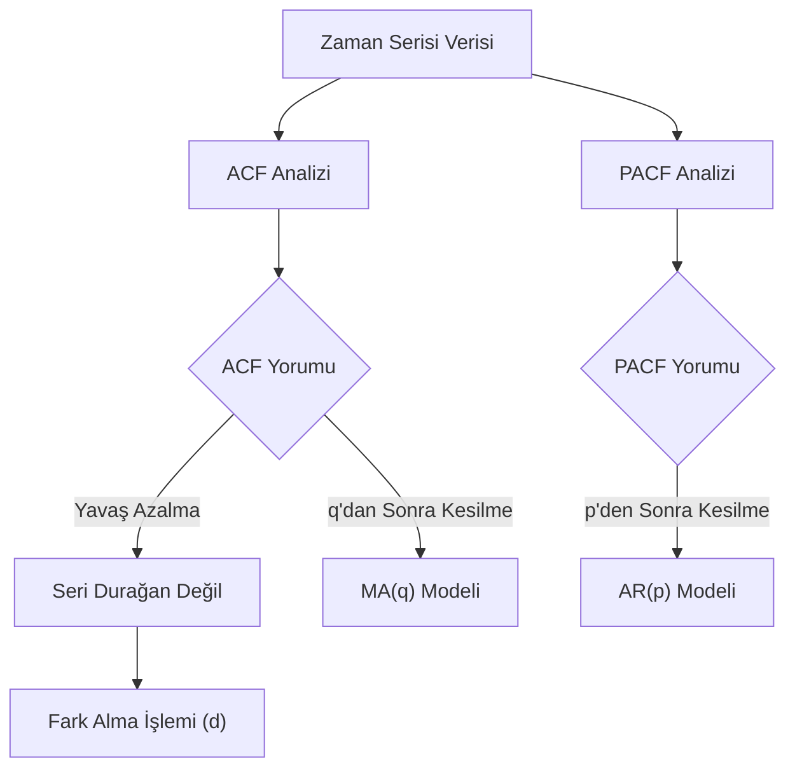

## 📌 Özet
ACF (Otokorelasyon Fonksiyonu) ve PACF (Kısmi Otokorelasyon Fonksiyonu), zaman serisi verilerindeki içsel bağımlılıkları anlamak ve ARIMA gibi modellerin parametrelerini (p ve q) belirlemek için kullanılan en kritik araçlardır. ACF, bir gözlem ile önceki gecikmeli değerleri arasındaki toplam korelasyonu ölçerken; PACF, aradaki diğer gecikmelerin etkisini arındırarak doğrudan ilişkiyi ortaya koyar. Bu grafikler sayesinde serinin durağan olup olmadığı, mevsimsel etkiler barındırıp barındırmadığı ve hangi model yapısının (AR, MA veya ARMA) veriye daha uygun olduğu bilimsel bir temelde analiz edilir. Özellikle Box-Jenkins metodolojisinin temelini oluşturan bu analizler, tahmin modellerinin başarısını doğrudan etkiler.

## 🧠 Detay



### ACF (Otokorelasyon Fonksiyonu)
```python
from statsmodels.graphics.tsaplots import plot_acf, plot_pacf
import matplotlib.pyplot as plt

fig, axes = plt.subplots(1, 2, figsize=(14, 4))

plot_acf(df["satis"].dropna(), lags=40, ax=axes[0])
axes[0].set_title("ACF - Otokorelasyon")

plot_pacf(df["satis"].dropna(), lags=40, ax=axes[1])
axes[1].set_title("PACF - Kısmi Otokorelasyon")

plt.tight_layout()
plt.show()
```

### ACF ve PACF Okuma Rehberi
```
Grafik Yorumlama:
  Mavi bant → güven aralığı (%95)
  Bandın dışına çıkan çubuklar → anlamlı otokorelasyon

ACF:
  Yavaş azalma → seri durağan değil, fark al
  Lag s'de sivri → mevsimsellik var (s periyot)
  q parametresi için: anlamlı lag sayısı

PACF:
  p parametresi için: anlamlı lag sayısı
```

### ARIMA Parametre Seçim Tablosu
```
| Model | ACF               | PACF              |
|-------|-------------------|-------------------|
| AR(p) | Yavaş azalır      | p lag'dan sonra kesilir |
| MA(q) | q lag'dan sonra kesilir | Yavaş azalır |
| ARMA  | Yavaş azalır      | Yavaş azalır      |
```

### Mevsimsel ACF/PACF
```python
# Fark alındıktan sonra kontrol et
seri_fark = df["satis"].diff(1).diff(12).dropna()

fig, axes = plt.subplots(2, 2, figsize=(14, 8))
plot_acf(df["satis"].dropna(), lags=40, ax=axes[0, 0], title="Orijinal ACF")
plot_pacf(df["satis"].dropna(), lags=40, ax=axes[0, 1], title="Orijinal PACF")
plot_acf(seri_fark, lags=40, ax=axes[1, 0], title="Fark Alınmış ACF")
plot_pacf(seri_fark, lags=40, ax=axes[1, 1], title="Fark Alınmış PACF")
plt.tight_layout()
```

### Ljung-Box Testi (Beyaz Gürültü?)
```python
from statsmodels.stats.diagnostic import acorr_ljungbox

# Kalıntıların otokorelasyonu var mı?
test = acorr_ljungbox(residuals, lags=[10, 20], return_df=True)
print(test)
# p > 0.05 → beyaz gürültü → model iyi
```

### Sayısal ACF Değerleri
```python
from statsmodels.tsa.stattools import acf, pacf

acf_degerler = acf(df["satis"], nlags=20)
pacf_degerler = pacf(df["satis"], nlags=20)

print("ACF değerleri:", acf_degerler[:6])
print("PACF değerleri:", pacf_degerler[:6])
```

## 💡 Bağlantılar
- [[TS - Durağanlık ve Birim Kök Testleri]]
- [[TS - ARIMA Modeli]]
- [[TS - SARIMA Modeli]]

## ❓ Sorular / Anlamadıklarım
- ACF grafiğinde sinüsoidal desen ne anlama gelir?
- Güven bandı nasıl hesaplanır?

## 🔗 Kaynaklar
- https://www.statsmodels.org/stable/graphics.html#autocorrelation-plots
