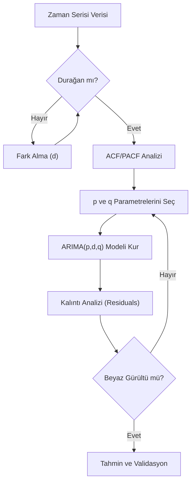

## 📌 Özet
ARIMA (AutoRegressive Integrated Moving Average), zaman serisi tahminleme dünyasının en temel ve yaygın kullanılan parametrik modellerinden biridir. Model; geçmiş değerlere dayanan 'Öz-bağlanımlı' (AR), veriyi durağanlaştırmak için uygulanan 'Bütünleşik' (I) fark alma ve geçmiş hata terimlerini kullanan 'Hareketli Ortalama' (MA) bileşenlerinden oluşur. ARIMA(p, d, q) notasyonu ile ifade edilen bu modelde; p gecikme sayısını, d durağanlık için gereken fark derecesini, q ise hata terimi penceresini temsil eder. Box-Jenkins metodolojisi çerçevesinde kurulan ARIMA modelleri, kısa vadeli tahminlerde yüksek doğruluk sunarken, serinin durağan olması ön şartına dayanır.

## 🧠 Detay



### ARIMA Parametreleri

```
p → AR terimi: kaç lag kullanılacak
d → Differencing: durağanlaştırma için fark sayısı
q → MA terimi: hata teriminin kaç lag'ı kullanılacak

ARIMA(1,1,1):
  AR(1): y(t) = c + φ₁y(t-1) + ε(t)
  d=1:   fark alınmış seri
  MA(1): ε(t) = θ₁ε(t-1) + η(t)
```

### Manuel ARIMA
```python
from statsmodels.tsa.arima.model import ARIMA
import matplotlib.pyplot as plt

# Eğitim/test ayrımı
train = df["satis"][:-12]
test = df["satis"][-12:]

# Model kur ve eğit
model = ARIMA(train, order=(1, 1, 1))
sonuc = model.fit()
print(sonuc.summary())

# Tahmin
tahmin = sonuc.forecast(steps=12)
conf_int = sonuc.get_forecast(steps=12).conf_int()

# Görselleştirme
plt.figure(figsize=(12, 5))
plt.plot(train.index, train, label="Eğitim")
plt.plot(test.index, test, label="Gerçek", color="green")
plt.plot(test.index, tahmin, label="Tahmin", color="red", linestyle="--")
plt.fill_between(test.index,
    conf_int.iloc[:, 0], conf_int.iloc[:, 1],
    alpha=0.2, color="red")
plt.legend()
plt.title("ARIMA(1,1,1) Tahmini")
```

### Otomatik ARIMA (pmdarima)
```python
import pmdarima as pm

# En iyi parametreleri otomatik bul
model_auto = pm.auto_arima(
    train,
    start_p=0, start_q=0,
    max_p=5, max_q=5,
    d=None,               # otomatik belirle
    seasonal=False,
    information_criterion="aic",
    stepwise=True,
    trace=True
)

print(model_auto.summary())
print(f"En iyi order: {model_auto.order}")

tahmin, conf = model_auto.predict(n_periods=12, return_conf_int=True)
```

### Model Seçim Kriterleri
```python
# AIC ve BIC karşılaştırması
sonuclar = []
for p in range(0, 4):
    for q in range(0, 4):
        try:
            m = ARIMA(train, order=(p, 1, q)).fit()
            sonuclar.append({"p": p, "q": q, "AIC": m.aic, "BIC": m.bic})
        except:
            pass

import pandas as pd
df_sonuc = pd.DataFrame(sonuclar).sort_values("AIC")
print(df_sonuc.head(10))
```

### Artık (Residual) Analizi
```python
residuals = pd.Series(sonuc.resid)

fig, axes = plt.subplots(2, 2, figsize=(12, 8))

# Artıklar
residuals.plot(ax=axes[0, 0], title="Artıklar")
axes[0, 0].axhline(0, color="red")

# Dağılım
residuals.plot(kind="hist", bins=20, ax=axes[0, 1], title="Dağılım")

# ACF
from statsmodels.graphics.tsaplots import plot_acf
plot_acf(residuals, ax=axes[1, 0], title="Artık ACF")

# QQ Plot
from scipy import stats
stats.probplot(residuals, plot=axes[1, 1])

plt.tight_layout()
```

## 💡 Bağlantılar
- [[TS - ACF ve PACF Analizi]]
- [[TS - Durağanlık ve Birim Kök Testleri]]
- [[TS - SARIMA Modeli]]
- [[TS - Model Değerlendirme Metrikleri]]

## ❓ Sorular / Anlamadıklarım
- AIC ile BIC çelişirse hangisini seçmeliyim?
- ARIMA'nın sıfır katsayıları ne anlama gelir?

## 🔗 Kaynaklar
- https://www.statsmodels.org/stable/generated/statsmodels.tsa.arima.model.ARIMA.html
- https://alkaline-ml.com/pmdarima/
