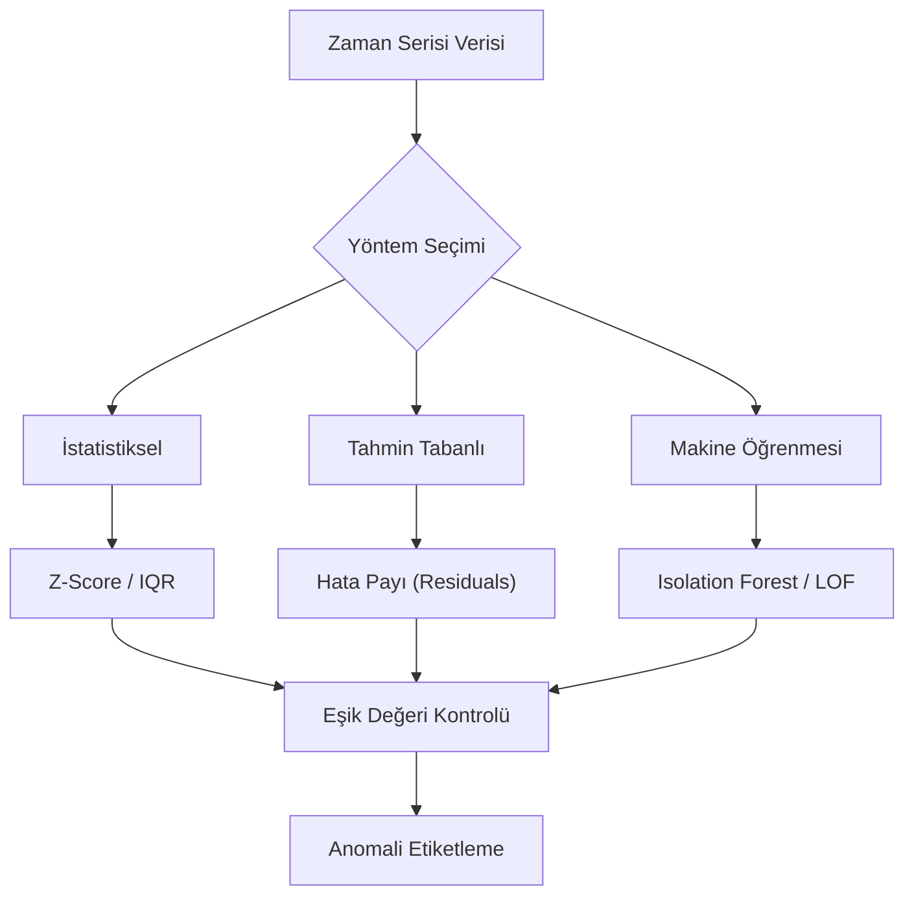

## 📌 Özet
Zaman serilerinde anomali tespiti, verinin genel akışından belirgin şekilde sapan, beklenen örüntülere uymayan ve genellikle 'aykırı değer' olarak adlandırılan veri noktalarının veya segmentlerinin otomatik olarak belirlenmesi sürecidir. Bu süreç, ağ trafiği güvenliği, finansal dolandırıcılık tespiti, endüstriyel sensör verilerindeki arıza izleme ve pazarlama analizlerindeki ani trend değişikliklerini yakalamak için hayati önem taşır. Anomali tespiti yöntemleri; basit istatistiksel sınır kontrollerinden (Z-Score, IQR), zaman serisi modellerinin (SARIMA, Prophet) tahmin hatalarının analizine ve gelişmiş makine öğrenmesi algoritmalarına (Isolation Forest, Autoencoders) kadar geniş bir yelpazeyi kapsar. Başarılı bir analiz için verinin mevsimsellik ve trend bileşenlerinden arındırılması, gerçek anomalilerin sistemik gürültüden doğru şekilde ayırt edilmesini sağlar.

## 🧠 Detay



### İstatistiksel Yöntemler
```python
import pandas as pd
import numpy as np
import matplotlib.pyplot as plt

# Z-Score yöntemi
def zscore_anomali(seri, esik=3.0):
    ort = seri.rolling(window=30, center=True).mean()
    std = seri.rolling(window=30, center=True).std()
    z = np.abs((seri - ort) / std)
    return z > esik

df["anomali_z"] = zscore_anomali(df["satis"])

# IQR yöntemi (pencereli)
def iqr_anomali(seri, pencere=30, carpan=1.5):
    Q1 = seri.rolling(pencere).quantile(0.25)
    Q3 = seri.rolling(pencere).quantile(0.75)
    IQR = Q3 - Q1
    return (seri < Q1 - carpan * IQR) | (seri > Q3 + carpan * IQR)

df["anomali_iqr"] = iqr_anomali(df["satis"])
```

### SARIMA Artık Tabanlı
```python
from statsmodels.tsa.statespace.sarimax import SARIMAX

# Model fit et
model = SARIMAX(df["satis"], order=(1,1,1), seasonal_order=(1,1,1,12))
sonuc = model.fit(disp=False)

# Artıklar
residuals = sonuc.resid
sigma = residuals.std()

# ±3σ dışına çıkanlar anomali
esik = 3 * sigma
anomaliler = residuals[np.abs(residuals) > esik]
print(f"Bulunan anomali: {len(anomaliler)}")
```

### Isolation Forest
```python
from sklearn.ensemble import IsolationForest
import pandas as pd

# Özellikler
X = pd.DataFrame({
    "deger": df["satis"],
    "lag1": df["satis"].shift(1),
    "lag7": df["satis"].shift(7),
    "ma7": df["satis"].rolling(7).mean()
}).dropna()

iso = IsolationForest(
    contamination=0.05,   # tahminî anomali oranı
    random_state=42
)
X["anomali"] = iso.fit_predict(X)
# -1 = anomali, 1 = normal
```

### Prophet ile Anomali
```python
from prophet import Prophet

model = Prophet(interval_width=0.99)   # çok geniş güven aralığı
model.fit(df_prophet)

tahmin = model.predict(df_prophet)

# Güven aralığı dışına çıkanlar
anomaliler = df_prophet[
    (df_prophet["y"] > tahmin["yhat_upper"]) |
    (df_prophet["y"] < tahmin["yhat_lower"])
]
```

### Görselleştirme
```python
fig, ax = plt.subplots(figsize=(14, 5))
ax.plot(df.index, df["satis"], label="Satış", alpha=0.7)

# Anomali noktalarını işaretle
anomali_idx = df[df["anomali_z"]].index
ax.scatter(anomali_idx, df.loc[anomali_idx, "satis"],
    color="red", s=100, zorder=5, label="Anomali")

ax.legend()
ax.set_title("Zaman Serisi Anomali Tespiti")
plt.tight_layout()
```

### Changepoint Tespiti
```python
import ruptures as rpt

# PELT algoritması
model_rpt = rpt.Pelt(model="rbf", min_size=3, jump=1)
model_rpt.fit(df["satis"].values)

breakpoints = model_rpt.predict(pen=10)
print(f"Kırılma noktaları: {breakpoints}")
```

## 💡 Bağlantılar
- [[TS - Zaman Serisi Temel Kavramlar]]
- [[TS - SARIMA Modeli]]
- [[TS - Prophet ile Tahmin]]

## ❓ Sorular / Anlamadıklarım
- Anomali mi gerçek olay mı? Nasıl ayırt edilir?
- Contamination parametresi nasıl belirlenir?

## 🔗 Kaynaklar
- https://scikit-learn.org/stable/modules/outlier_detection.html
- https://centre-borelli.github.io/ruptures-docs/
