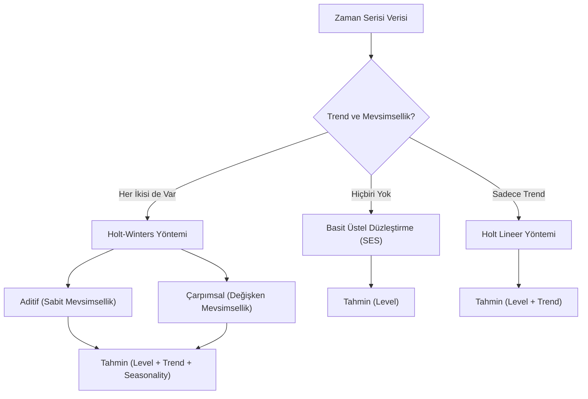

## 📌 Özet
Üstel Düzleştirme (Exponential Smoothing), geçmiş gözlemlerin ağırlıklarını zaman geçtikçe geometrik olarak azaltan ve en son verilere daha yüksek önem atfeden bir tahmin yöntemleri ailesidir. Basit Üstel Düzleştirme (SES) yalnızca seviyeyi modellerken, Holt'un Lineer Trend yöntemi eğilimi (trend), Holt-Winters yöntemi ise hem trendi hem de mevsimselliği modele dahil eder. Bu yöntemler, özellikle verinin yapısal değişimler gösterdiği durumlarda ARIMA gibi karmaşık modellere güçlü bir alternatif sunar. ETS (Error-Trend-Seasonality) çerçevesi altında aditif veya çarpımsal bileşenlerle yapılandırılabilen bu modeller, esneklikleri ve hesaplama hızları nedeniyle iş dünyasında stok ve talep tahminleri için sıkça tercih edilir.

## 🧠 Detay



### Basit Üstel Düzleştirme (SES)
```python
from statsmodels.tsa.holtwinters import SimpleExpSmoothing

# Trend ve mevsimsellik YOK olan seriler için
model = SimpleExpSmoothing(train, initialization_method="estimated")
sonuc = model.fit(optimized=True)

print(f"Alpha: {sonuc.params['smoothing_level']:.4f}")
# Alpha yakın 1 → son gözleme çok ağırlık
# Alpha yakın 0 → geçmişe daha çok ağırlık

tahmin = sonuc.forecast(12)
```

### Holt'un Lineer Trendi (Double Exponential)
```python
from statsmodels.tsa.holtwinters import Holt

# Trend VAR, mevsimsellik YOK
model = Holt(train, initialization_method="estimated")
sonuc = model.fit(optimized=True, damped_trend=True)  # sönümlü trend

print(f"Alpha: {sonuc.params['smoothing_level']:.4f}")
print(f"Beta:  {sonuc.params['smoothing_trend']:.4f}")
```

### Holt-Winters (Triple Exponential)
```python
from statsmodels.tsa.holtwinters import ExponentialSmoothing

# Aditif Holt-Winters
model_add = ExponentialSmoothing(
    train,
    trend="add",
    seasonal="add",
    seasonal_periods=12,
    initialization_method="estimated"
)
sonuc_add = model_add.fit(optimized=True)

# Çarpımsal Holt-Winters
model_mul = ExponentialSmoothing(
    train,
    trend="add",
    seasonal="mul",
    seasonal_periods=12,
    initialization_method="estimated",
    damped_trend=True
)
sonuc_mul = model_mul.fit(optimized=True)

print(f"Aditif AIC:      {sonuc_add.aic:.2f}")
print(f"Çarpımsal AIC:   {sonuc_mul.aic:.2f}")
```

### ETS Modeli (Error-Trend-Season)
```python
from statsmodels.tsa.exponential_smoothing.ets import ETSModel

# Otomatik bileşen seçimi
model_ets = ETSModel(
    train,
    error="add",
    trend="add",
    damped_trend=True,
    seasonal="add",
    seasonal_periods=12
)
sonuc_ets = model_ets.fit(disp=False)
print(sonuc_ets.summary())
```

### Model Karşılaştırması
```python
import pandas as pd
import numpy as np

modeller = {
    "SES": SimpleExpSmoothing(train).fit(optimized=True),
    "Holt": Holt(train).fit(optimized=True, damped_trend=True),
    "HW-Add": ExponentialSmoothing(train, trend="add", seasonal="add", seasonal_periods=12).fit(),
    "HW-Mul": ExponentialSmoothing(train, trend="add", seasonal="mul", seasonal_periods=12).fit()
}

karsilastirma = pd.DataFrame({
    ad: {
        "AIC": m.aic,
        "RMSE": np.sqrt(np.mean((m.fittedvalues - train)**2))
    }
    for ad, m in modeller.items()
}).T

print(karsilastirma.sort_values("AIC"))
```

## 💡 Bağlantılar
- [[TS - Zaman Serisi Temel Kavramlar]]
- [[TS - ARIMA Modeli]]
- [[TS - Model Değerlendirme Metrikleri]]

## ❓ Sorular / Anlamadıklarım
- Damped trend ne zaman kullanılmalı?
- Aditif mi çarpımsal mı Holt-Winters?

## 🔗 Kaynaklar
- https://www.statsmodels.org/stable/generated/statsmodels.tsa.holtwinters.ExponentialSmoothing.html
