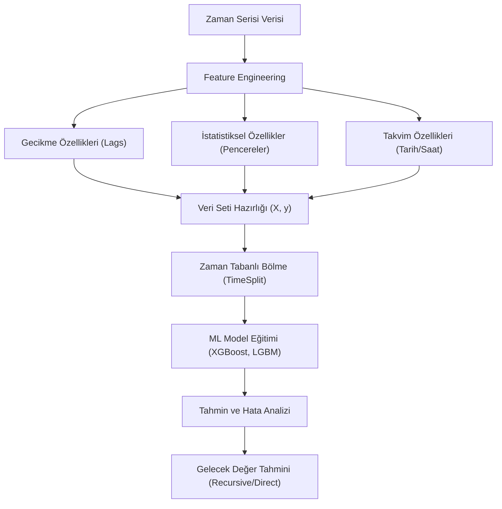

## 📌 Özet
Zaman serisi tahmininde makine öğrenmesi (ML) yaklaşımı, klasik istatistiksel modellerin aksine, problemi bir denetimli öğrenme (supervised learning) regresyon görevine dönüştürerek çözer. Bu yöntemde en kritik adım; geçmiş değerlerden gecikme (lag), hareketli ortalama (moving average) ve takvim tabanlı (ay, gün, tatil vb.) özelliklerin türetildiği 'Feature Engineering' sürecidir. XGBoost, LightGBM ve Random Forest gibi güçlü algoritmalar; çok değişkenli verilerle çalışabilme, doğrusal olmayan karmaşık ilişkileri yakalayabilme ve dışsal faktörleri (fiyat, hava durumu, kampanya) modele kolayca dahil edebilme yetenekleri sayesinde genellikle ARIMA modellerinden daha yüksek performans sergiler. Ancak bu modellerin zaman serisi doğasına uygun şekilde 'Walk-Forward Validation' gibi özel yöntemlerle doğrulanması, aşırı öğrenmeyi (overfitting) önlemek için hayatidir.

## 🧠 Detay



### Zaman Serisi Feature Engineering
```python
import pandas as pd
import numpy as np

def ts_ozellik_uret(df, hedef, lag_listesi, pencere_listesi):
    df = df.copy()

    # Lag özellikleri
    for lag in lag_listesi:
        df[f"lag_{lag}"] = df[hedef].shift(lag)

    # Hareketli ortalama
    for p in pencere_listesi:
        df[f"ma_{p}"] = df[hedef].shift(1).rolling(p).mean()
        df[f"std_{p}"] = df[hedef].shift(1).rolling(p).std()
        df[f"min_{p}"] = df[hedef].shift(1).rolling(p).min()
        df[f"max_{p}"] = df[hedef].shift(1).rolling(p).max()

    # Tarih özellikleri
    df["yil"]        = df.index.year
    df["ay"]         = df.index.month
    df["gun"]        = df.index.day
    df["haftaici"]   = df.index.weekday
    df["haftano"]    = df.index.isocalendar().week.astype(int)
    df["ceyrek"]     = df.index.quarter
    df["ay_sonu"]    = df.index.is_month_end.astype(int)
    df["yil_basi"]   = (df.index.month == 1).astype(int)

    return df.dropna()

df_ozellik = ts_ozellik_uret(
    df, "satis",
    lag_listesi=[1, 2, 3, 6, 12, 24],
    pencere_listesi=[3, 6, 12]
)
```

### Walk-Forward Validation (Doğru Yöntem)
```python
from sklearn.model_selection import TimeSeriesSplit

tss = TimeSeriesSplit(n_splits=5, gap=0)

for train_idx, test_idx in tss.split(X):
    X_tr, X_te = X.iloc[train_idx], X.iloc[test_idx]
    y_tr, y_te = y.iloc[train_idx], y.iloc[test_idx]
    # model eğit ve değerlendir
```

### XGBoost ile Tahmin
```python
import xgboost as xgb
from sklearn.metrics import mean_absolute_percentage_error

X = df_ozellik.drop(columns=["satis"])
y = df_ozellik["satis"]

# Son 12 ay test
n_test = 12
X_train, X_test = X.iloc[:-n_test], X.iloc[-n_test:]
y_train, y_test = y.iloc[:-n_test], y.iloc[-n_test:]

model = xgb.XGBRegressor(
    n_estimators=500,
    learning_rate=0.05,
    max_depth=4,
    subsample=0.8,
    colsample_bytree=0.8,
    early_stopping_rounds=50,
    random_state=42
)

model.fit(X_train, y_train,
    eval_set=[(X_test, y_test)],
    verbose=False)

y_pred = model.predict(X_test)
mape = mean_absolute_percentage_error(y_test, y_pred)
print(f"MAPE: {mape:.3%}")
```

### Özellik Önemi
```python
import matplotlib.pyplot as plt

onem = pd.DataFrame({
    "ozellik": X.columns,
    "onem": model.feature_importances_
}).sort_values("onem", ascending=True).tail(20)

plt.figure(figsize=(10, 8))
plt.barh(onem["ozellik"], onem["onem"])
plt.title("XGBoost Özellik Önemi")
plt.tight_layout()
```

### Çoklu Adım Tahmini
```python
# Recursive strateji
tahminler = []
son_veri = X_test.iloc[[0]].copy()

for adim in range(12):
    tahmin = model.predict(son_veri)[0]
    tahminler.append(tahmin)

    # Bir sonraki adım için lag güncelle
    son_veri["lag_1"] = tahmin
    son_veri["lag_2"] = son_veri["lag_1"]
    # ...
```

## 💡 Bağlantılar
- [[TS - ARIMA Modeli]]
- [[TS - Model Değerlendirme Metrikleri]]
- [[ML - Gradient Boosting ve XGBoost]]
- [[ML - Özellik Seçimi]]

## ❓ Sorular / Anlamadıklarım
- ML modelleri ARIMA'dan ne zaman daha iyi?
- Çok adımlı tahmin için en iyi strateji hangisi?

## 🔗 Kaynaklar
- https://xgboost.readthedocs.io
