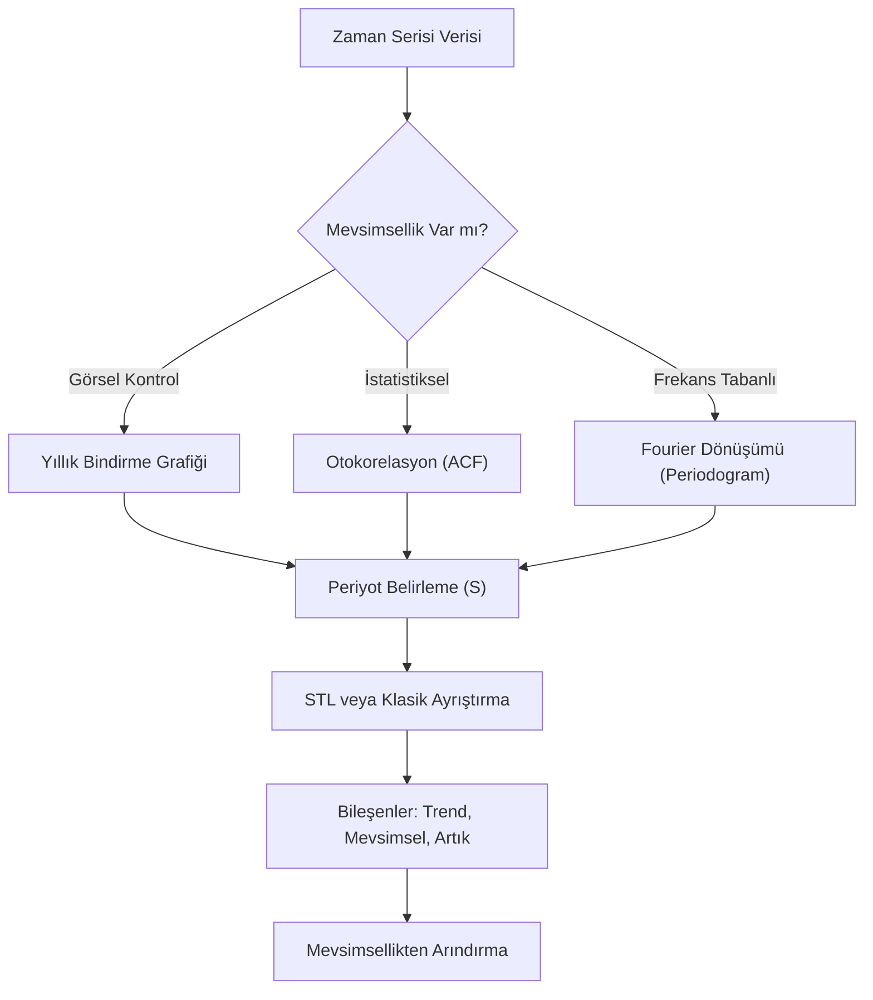

## 📌 Özet
Mevsimsellik (Seasonality), zaman serisi verilerinde belirli takvim aralıklarıyla (günlük, haftalık, aylık veya yıllık) düzenli olarak tekrarlanan dalgalanmaları ifade eder. Bu örüntülerin doğru bir şekilde tespit edilmesi; perakende satışları, turizm talepleri veya enerji tüketimi gibi alanlarda isabetli tahminler yapabilmek için kritik bir öneme sahiptir. Analiz sürecinde veriyi; trend, mevsimsellik ve kalıntı (artık) bileşenlerine ayıran STL (Seasonal-Trend decomposition using LOESS) gibi yöntemler kullanılarak serinin iç yapısı çözümlenir. Mevsimsel etkilerin tespit edilmesi, modelin bu döngüsel hareketleri öğrenmesini sağlayarak tahmin hatalarını minimize eder ve 'mevsimsellikten arındırma' yoluyla temel trendin daha net görülmesine imkan tanır.

## 🧠 Detay



### Mevsimsellik Tespiti
```python
import pandas as pd
import numpy as np
import matplotlib.pyplot as plt
from statsmodels.tsa.seasonal import seasonal_decompose, STL

# Görsel yöntem: Yıllık bindirme
fig, ax = plt.subplots(figsize=(12, 5))
for yil in df.index.year.unique():
    subset = df[df.index.year == yil]
    ax.plot(subset.index.month, subset["satis"], label=str(yil), marker="o")
ax.legend()
ax.set_xticks(range(1, 13))
ax.set_xticklabels(["O","Ş","M","N","M","H","T","A","E","E","K","A"])
ax.set_title("Yıllık Bindirme - Mevsimsellik Kontrolü")
```

### STL Ayrıştırma (Güçlü Yöntem)
```python
from statsmodels.tsa.seasonal import STL

stl = STL(df["satis"], period=12, robust=True)
sonuc = stl.fit()

fig = sonuc.plot()
fig.set_size_inches(12, 8)

# Bileşenlere erişim
trend = sonuc.trend
mevsimsel = sonuc.seasonal
kalinti = sonuc.resid

# Mevsimsellik gücü
mevsim_gucu = max(0, 1 - kalinti.var() / (kalinti + mevsimsel).var())
print(f"Mevsimsellik gücü: {mevsim_gucu:.3f}")
# 0.64+ → güçlü mevsimsellik
```

### Mevsimsel Alt Seriler Grafiği
```python
# Her ay için ayrı grafik
fig, axes = plt.subplots(3, 4, figsize=(14, 8))
ay_adlari = ["Oca","Şub","Mar","Nis","May","Haz",
             "Tem","Ağu","Eyl","Eki","Kas","Ara"]

for i, ax in enumerate(axes.flat):
    ay_verisi = df[df.index.month == i+1]["satis"]
    ax.plot(ay_verisi.values, marker="o")
    ax.axhline(ay_verisi.mean(), color="red", linestyle="--")
    ax.set_title(ay_adlari[i])

plt.suptitle("Mevsimsel Alt Seriler")
plt.tight_layout()
```

### Fourier Dönüşümü ile Periyot Tespiti
```python
from scipy import signal

# Güç spektrumu
f, Pxx = signal.periodogram(df["satis"].dropna())
periyotlar = 1 / f[1:]  # frekans → periyota çevir

# En güçlü periyotlar
top5_idx = np.argsort(Pxx[1:])[-5:][::-1]
print("En güçlü periyotlar:")
for idx in top5_idx:
    print(f"  Periyot: {periyotlar[idx]:.1f} adım")
```

### Mevsimsel Düzeltme
```python
# STL ile mevsimsel düzeltme
mevsim_duzeltilmis = df["satis"] - sonuc.seasonal

plt.figure(figsize=(12, 4))
plt.plot(df.index, df["satis"], label="Orijinal", alpha=0.5)
plt.plot(df.index, mevsim_duzeltilmis, label="Mevsimsel Düzeltilmiş")
plt.legend()
plt.title("Mevsimsel Düzeltme")
```

### Fourier Terimi ile Mevsimsellik Modelleme
```python
# Karmaşık mevsimsellikler için
def fourier_terms(n, period, order):
    t = np.arange(n)
    terms = {}
    for k in range(1, order + 1):
        terms[f"sin_{k}"] = np.sin(2 * np.pi * k * t / period)
        terms[f"cos_{k}"] = np.cos(2 * np.pi * k * t / period)
    return pd.DataFrame(terms)

fourier = fourier_terms(len(df), period=12, order=3)
```

## 💡 Bağlantılar
- [[TS - Zaman Serisi Temel Kavramlar]]
- [[TS - SARIMA Modeli]]
- [[TS - Prophet ile Tahmin]]

## ❓ Sorular / Anlamadıklarım
- Çoklu mevsimsellik (haftalık + yıllık) nasıl modellenir?
- STL ve classical decompose arasındaki fark?

## 🔗 Kaynaklar
- https://www.statsmodels.org/stable/generated/statsmodels.tsa.seasonal.STL.html
