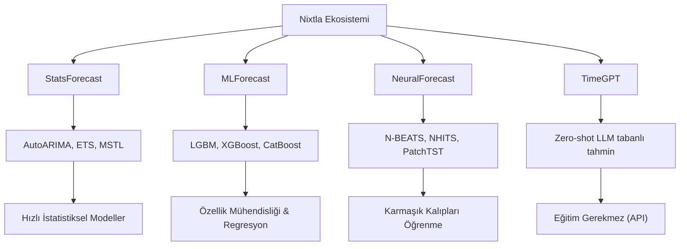

## 📌 Özet
Nixtla ekosistemi, zaman serisi tahmini alanında hızı, ölçeklenebilirliği ve doğruluğu bir araya getiren modern bir kütüphane setidir. StatsForecast ile klasik istatistiksel modelleri, MLForecast ile makine öğrenmesi yaklaşımlarını ve NeuralForecast ile derin öğrenme modellerini (N-BEATS, PatchTST vb.) tek bir çatı altında sunar. Geleneksel kütüphanelere göre en büyük avantajı, binlerce farklı zaman serisini aynı anda ve son derece verimli bir şekilde modelleyebilmesidir. Ayrıca TimeGPT gibi "foundation model" yaklaşımlarıyla, eğitim gerektirmeyen (zero-shot) yüksek performanslı tahminler yapılmasına imkan tanır.

## 🧠 Detay



### StatsForecast
```python
pip install statsforecast

from statsforecast import StatsForecast
from statsforecast.models import AutoARIMA, AutoETS, AutoTheta, MSTL

# Veri formatı: unique_id, ds, y
df_sf = df.reset_index()
df_sf.columns = ["ds", "y"]
df_sf["unique_id"] = "satis_1"

# Birden fazla model aynı anda
modeller = [
    AutoARIMA(season_length=12),
    AutoETS(season_length=12),
    AutoTheta(season_length=12),
    MSTL(season_length=[12, 4])
]

sf = StatsForecast(
    models=modeller,
    freq="M",
    n_jobs=-1
)

# Cross validation
cv_df = sf.cross_validation(
    df=df_sf,
    h=12,           # tahmin ufku
    n_windows=3,    # kaç pencere
    step_size=3
)

# Tahmin
sf.fit(df_sf)
tahmin = sf.predict(h=12, level=[80, 95])
print(tahmin)
```

### MLForecast
```python
pip install mlforecast

from mlforecast import MLForecast
from mlforecast.target_transforms import Differences
import lightgbm as lgb

mlf = MLForecast(
    models=[
        lgb.LGBMRegressor(n_estimators=200, learning_rate=0.05)
    ],
    freq="M",
    lags=[1, 2, 3, 6, 12],
    lag_transforms={
        1: [("rolling_mean", 3), ("rolling_std", 3)],
        12: [("rolling_mean", 12)]
    },
    date_features=["month", "year", "quarter"],
    target_transforms=[Differences([1, 12])]
)

mlf.fit(df_sf)
tahmin = mlf.predict(h=12)
```

### NeuralForecast
```python
pip install neuralforecast

from neuralforecast import NeuralForecast
from neuralforecast.models import NBEATS, NHITS, PatchTST

nf = NeuralForecast(
    models=[
        NBEATS(input_size=24, h=12, max_steps=500),
        NHITS(input_size=24, h=12, max_steps=500),
    ],
    freq="M"
)

nf.fit(df_sf)
tahmin = nf.predict()
```

### TimeGPT (Nixtla API)
```python
pip install nixtla

from nixtla import NixtlaClient

client = NixtlaClient(api_key="API_KEY")

# Sıfır shot tahmin!
tahmin = client.forecast(
    df=df_sf,
    h=12,
    freq="M",
    time_col="ds",
    target_col="y"
)
```

### Çoklu Seri Tahmini
```python
# 1000 ürün için aynı anda tahmin
df_coklu = pd.DataFrame({
    "unique_id": np.repeat([f"urun_{i}" for i in range(100)], 36),
    "ds": pd.date_range("2021-01-01", periods=36, freq="M").tolist() * 100,
    "y": np.random.randn(3600) * 100 + 500
})

sf.fit(df_coklu)
tahminler = sf.predict(h=12)
print(tahminler.groupby("unique_id").head(3))
```

## 💡 Bağlantılar
- [[TS - ARIMA Modeli]]
- [[TS - Prophet ile Tahmin]]
- [[TS - ML ile Zaman Serisi Tahmini]]
- [[TS - Model Değerlendirme Metrikleri]]

## ❓ Sorular / Anlamadıklarım
- StatsForecast ne zaman statsmodels'ten daha iyi?
- TimeGPT ne kadar güvenilir, ne zaman kullanılmalı?

## 🔗 Kaynaklar
- https://nixtlaverse.nixtla.io/statsforecast/
- https://nixtlaverse.nixtla.io/neuralforecast/
