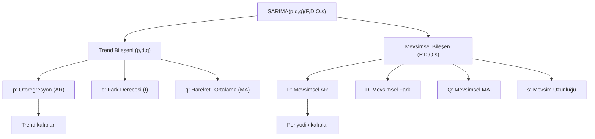

## 📌 Özet
SARIMA (Seasonal Autoregressive Integrated Moving Average), klasik ARIMA modelinin mevsimsellik içeren veriler için genişletilmiş bir versiyonudur. Standart (p, d, q) parametrelerine ek olarak, mevsimsel periyotlardaki AR, Fark ve MA etkilerini temsil eden (P, D, Q, s) parametre kümesini kullanır. Bu yapı sayesinde model, hem uzun vadeli trendleri hem de periyodik olarak tekrarlanan (aylık, çeyreklik veya haftalık) kalıpları aynı anda yakalayabilir. Karmaşıklığına rağmen, özellikle istatistiksel anlamlılığın ve model açıklanabilirliğinin kritik olduğu durumlarda en güçlü tahmin araçlarından biridir.

## 🧠 Detay



### SARIMA Parametreleri
```
(p, d, q) → ARIMA kısmı (trend)
(P, D, Q, s) → Mevsimsel kısım
  P → Mevsimsel AR
  D → Mevsimsel fark
  Q → Mevsimsel MA
  s → Mevsim uzunluğu (12=aylık, 4=çeyreklik, 7=haftalık)

Örnek: SARIMA(1,1,1)(1,1,1,12)
```

### Manuel SARIMA
```python
from statsmodels.tsa.statespace.sarimax import SARIMAX

train = df["satis"][:-12]
test = df["satis"][-12:]

model = SARIMAX(train,
    order=(1, 1, 1),
    seasonal_order=(1, 1, 1, 12),
    enforce_stationarity=False,
    enforce_invertibility=False
)
sonuc = model.fit(disp=False)
print(sonuc.summary())

# Tahmin
tahmin = sonuc.get_forecast(steps=12)
tahmin_ortalama = tahmin.predicted_mean
conf_int = tahmin.conf_int()

import matplotlib.pyplot as plt
plt.figure(figsize=(12, 5))
plt.plot(train[-24:], label="Eğitim")
plt.plot(test, label="Gerçek", color="green")
plt.plot(tahmin_ortalama, label="Tahmin", color="red", linestyle="--")
plt.fill_between(test.index,
    conf_int.iloc[:, 0], conf_int.iloc[:, 1],
    alpha=0.2, color="red")
plt.legend()
plt.title("SARIMA(1,1,1)(1,1,1,12)")
```

### Otomatik SARIMA
```python
import pmdarima as pm

model_sarima = pm.auto_arima(
    train,
    start_p=0, start_q=0,
    max_p=3, max_q=3,
    start_P=0, start_Q=0,
    max_P=2, max_Q=2,
    d=1, D=1,
    seasonal=True,
    m=12,
    information_criterion="aic",
    stepwise=True,
    trace=True,
    error_action="ignore",
    suppress_warnings=True
)

print(f"En iyi model: SARIMA{model_sarima.order}{model_sarima.seasonal_order}")
```

### Grid Search
```python
import itertools
import warnings

p = d = q = range(0, 3)
P = D = Q = range(0, 2)
s = 12

parametreler = list(itertools.product(p, d, q))
mevsim_parametreler = [(x[0], x[1], x[2], s) for x in itertools.product(P, D, Q)]

en_iyi_aic = float("inf")
en_iyi_param = None

for param in parametreler:
    for mparam in mevsim_parametreler:
        try:
            m = SARIMAX(train, order=param, seasonal_order=mparam).fit(disp=False)
            if m.aic < en_iyi_aic:
                en_iyi_aic = m.aic
                en_iyi_param = (param, mparam)
        except:
            pass

print(f"En iyi: {en_iyi_param}, AIC: {en_iyi_aic:.2f}")
```

### SARIMAX (Dış Değişkenli)
```python
# Tatil, fiyat gibi dış değişkenler ekle
model = SARIMAX(train,
    exog=train_exog,   # dış değişkenler
    order=(1, 1, 1),
    seasonal_order=(1, 1, 1, 12)
)
sonuc = model.fit()
tahmin = sonuc.forecast(steps=12, exog=test_exog)
```

## 💡 Bağlantılar
- [[TS - ARIMA Modeli]]
- [[TS - Mevsimsellik Analizi]]
- [[TS - Model Değerlendirme Metrikleri]]

## ❓ Sorular / Anlamadıklarım
- D=0 vs D=1 ne zaman hangisi?
- Çok fazla parametre overfitting'e neden olur mu?

## 🔗 Kaynaklar
- https://www.statsmodels.org/stable/generated/statsmodels.tsa.statespace.sarimax.SARIMAX.html
