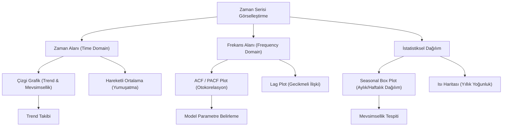

## 📌 Özet
Zaman serisi analizinde görselleştirme, verinin hikayesini anlamanın ilk ve en kritik adımıdır. Sadece rakamlara bakarak fark edilemeyen uzun vadeli trendler, periyodik mevsimsel döngüler ve veri setindeki uç değerler (anomaliler) görsel inceleme sayesinde gün yüzüne çıkar. Çizgi grafiklerinden ısı haritalarına, lag plotlardan kutu grafiklerine kadar farklı teknikler kullanılarak verinin otokorelasyon yapısı ve durağanlığı hakkında ön bilgi edinilir. İyi bir görselleştirme stratejisi, model seçimi öncesinde hipotez kurmayı kolaylaştırır ve sonuçların paydaşlara etkili bir şekilde sunulmasını sağlar.

## 🧠 Detay



### Temel Çizgi Grafik
```python
import pandas as pd
import matplotlib.pyplot as plt
import matplotlib.dates as mdates

fig, ax = plt.subplots(figsize=(14, 5))
ax.plot(df.index, df["satis"], linewidth=1.5, color="steelblue")
ax.set_title("Aylık Satış Trendi", fontsize=14)
ax.set_xlabel("Tarih")
ax.set_ylabel("Satış (TL)")
ax.xaxis.set_major_formatter(mdates.DateFormatter("%Y-%m"))
ax.xaxis.set_major_locator(mdates.MonthLocator(interval=3))
plt.xticks(rotation=45)
ax.grid(True, alpha=0.3)
plt.tight_layout()
plt.show()
```

### Çok Katmanlı Görselleştirme
```python
fig, axes = plt.subplots(4, 1, figsize=(14, 12))

# Ham veri
axes[0].plot(df.index, df["satis"])
axes[0].set_title("Ham Veri")

# Hareketli ortalama
axes[1].plot(df.index, df["satis"], alpha=0.3, label="Gerçek")
axes[1].plot(df.index, df["satis"].rolling(12).mean(), label="12 Aylık MA", linewidth=2)
axes[1].legend()
axes[1].set_title("Hareketli Ortalama")

# Mevsimsel kutu grafiği
df["ay"] = df.index.month
axes[2].boxplot([df[df["ay"]==m]["satis"] for m in range(1,13)])
axes[2].set_xticklabels(["Oca","Şub","Mar","Nis","May","Haz",
                          "Tem","Ağu","Eyl","Eki","Kas","Ara"])
axes[2].set_title("Aylık Dağılım (Mevsimsellik)")

# Yıllık karşılaştırma
for yil in df.index.year.unique():
    yil_data = df[df.index.year == yil]
    axes[3].plot(yil_data.index.month, yil_data["satis"], label=str(yil), marker="o")
axes[3].legend()
axes[3].set_title("Yıllara Göre Karşılaştırma")

plt.tight_layout()
```

### Lag Plot
```python
from pandas.plotting import lag_plot, autocorrelation_plot

# Otokorelasyon varlığını görsel kontrol
fig, axes = plt.subplots(2, 4, figsize=(14, 6))
for i, ax in enumerate(axes.flat):
    lag_plot(df["satis"], lag=i+1, ax=ax)
    ax.set_title(f"Lag {i+1}")
plt.tight_layout()
```

### Interaktif Plotly
```python
import plotly.express as px
import plotly.graph_objects as go

# Basit interaktif
fig = px.line(df, x=df.index, y="satis",
    title="Satış Trendi", labels={"satis": "Satış", "index": "Tarih"})
fig.update_xaxes(rangeslider_visible=True)
fig.show()

# Tahmin + Güven aralığı
fig = go.Figure()
fig.add_trace(go.Scatter(x=df.index, y=df["satis"], name="Gerçek"))
fig.add_trace(go.Scatter(x=tahmin.index, y=tahmin["yhat"],
    name="Tahmin", line=dict(dash="dash")))
fig.add_trace(go.Scatter(
    x=pd.concat([tahmin.index.to_series(), tahmin.index.to_series()[::-1]]),
    y=pd.concat([tahmin["yhat_upper"], tahmin["yhat_lower"][::-1]]),
    fill="toself", fillcolor="rgba(0,100,200,0.1)",
    line=dict(color="rgba(255,255,255,0)"), name="Güven Aralığı"))
fig.show()
```

### Isı Haritası (Takvim Görünümü)
```python
import seaborn as sns

pivot = df.pivot_table(values="satis",
    index=df.index.year, columns=df.index.month, aggfunc="sum")
pivot.columns = ["Oca","Şub","Mar","Nis","May","Haz",
                 "Tem","Ağu","Eyl","Eki","Kas","Ara"]

plt.figure(figsize=(12, 6))
sns.heatmap(pivot, annot=True, fmt=".0f", cmap="YlOrRd")
plt.title("Yıl-Ay Satış Isı Haritası")
```

## 💡 Bağlantılar
- [[TS - Zaman Serisi Temel Kavramlar]]
- [[TS - Durağanlık ve Birim Kök Testleri]]
- [[TS - Mevsimsellik Analizi]]

## ❓ Sorular / Anlamadıklarım
- Anomali görsel olarak nasıl tespit edilir?
- Birden fazla zaman serisini nasıl karşılaştırırım?

## 🔗 Kaynaklar
- https://plotly.com/python/time-series/
