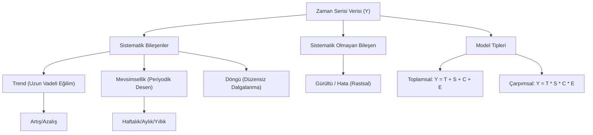

## 📌 Özet
Zaman serisi analizi, belirli bir zaman aralığında sıralı olarak toplanmış gözlemlerin altında yatan dinamikleri anlama ve gelecekteki değerleri öngörme sürecidir. Bir zaman serisi tipik olarak; uzun vadeli eğilimi gösteren trend, belirli periyotlarla tekrarlanan mevsimsellik, ekonomik veya iş çevrimlerini yansıtan döngü ve rastsal hatalardan oluşan gürültü bileşenlerinin birleşimidir. Bu bileşenlerin nasıl bir araya geldiğine bağlı olarak modeller toplamsal (additive) veya çarpımsal (multiplicative) olarak sınıflandırılır. Temel kavramları (gecikme, fark alma, otokorelasyon vb.) anlamak, veriyi tahmin modellerine hazırlamak için elzemdir.

## 🧠 Detay



### Zaman Serisi Bileşenleri
```
Trend (T)         → Uzun vadeli artış/azalış eğilimi
Mevsimsellik (S)  → Sabit periyotla tekrar eden desen (yıllık, haftalık)
Döngü (C)         → Düzensiz uzun vadeli dalgalanmalar
Gürültü (ε)       → Açıklanamayan rastsal değişimler
```

### Aditif vs Çarpımsal Model
```python
import pandas as pd
import numpy as np
import matplotlib.pyplot as plt

# Aditif: Y = T + S + C + ε (mevsimsellik sabit)
# Çarpımsal: Y = T × S × C × ε (mevsimsellik büyüklükle artar)

# Hangisi? → varyans zamanla artıyorsa çarpımsal
```

### Bileşen Ayrıştırma
```python
from statsmodels.tsa.seasonal import seasonal_decompose

df = pd.read_csv("satis.csv", index_col="tarih", parse_dates=True)

# Aditif ayrıştırma
sonuc = seasonal_decompose(df["satis"], model="additive", period=12)
sonuc.plot()
plt.tight_layout()
plt.show()

# Bileşenlere erişim
print(sonuc.trend.dropna().head())
print(sonuc.seasonal.head())
print(sonuc.resid.dropna().head())
```

### Temel Kavramlar
| Kavram | Açıklama |
|--------|----------|
| Lag | Geciktirme: t-1, t-2... |
| Differencing | Fark alma: y(t) - y(t-1) |
| ACF | Otokorelasyon fonksiyonu |
| PACF | Kısmi otokorelasyon fonksiyonu |
| Durağanlık | Ortalama ve varyans zamanla sabit |
| Forecast Horizon | Tahmin ufku (kaç adım ileri) |

### Zaman Serisi Tipleri
```python
# Düzenli → eşit aralıklı (günlük, saatlik)
# Düzensiz → farklı aralıklı (işlem verisi)
# Univariate → tek değişken
# Multivariate → çok değişken
# Panel → çok birim, çok zaman

# Frekans türleri
# D → günlük, W → haftalık, M → aylık
# Q → üç aylık, Y → yıllık, H → saatlik
```

### Pandas ile Zaman Serisi
```python
# DatetimeIndex oluştur
tarihler = pd.date_range("2020-01-01", periods=100, freq="D")
ts = pd.Series(np.random.randn(100), index=tarihler)

# Yeniden örnekleme
aylik = ts.resample("M").mean()
haftalik = ts.resample("W").sum()

# Hareketli ortalama
ts_ma7 = ts.rolling(window=7).mean()
ts_ema = ts.ewm(span=7).mean()
```

## 💡 Bağlantılar
- [[TS - Durağanlık ve Birim Kök Testleri]]
- [[TS - ACF ve PACF Analizi]]
- [[TS - Zaman Serisi Görselleştirme]]

## ❓ Sorular / Anlamadıklarım
- Aditif mi çarpımsal mı seçmeliyim nasıl karar veririm?
- Mevsimsellik periyodunu otomatik nasıl bulurum?

## 🔗 Kaynaklar
- https://otexts.com/fpp3/
- https://www.statsmodels.org/stable/tsa.html
