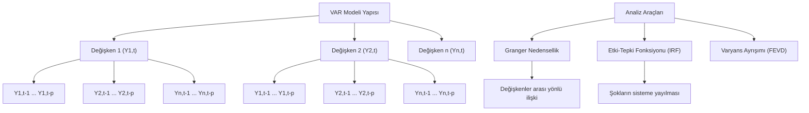

## 📌 Özet
VAR (Vector AutoRegression), birden fazla zaman serisinin birbirleriyle olan etkileşimlerini analiz etmek için kullanılan ileri düzey bir ekonometrik modeldir. Geleneksel tek değişkenli modellerin aksine VAR, her bir değişkenin hem kendi geçmiş değerlerine hem de modeldeki diğer tüm değişkenlerin geçmiş değerlerine bağlı olduğunu varsayar. Bu yapı, değişkenler arasındaki çift yönlü ilişkilerin (feedback loops) yakalanmasını sağlar. Modelin başarısı için tüm serilerin durağan olması kritik bir ön koşuldur ve değişkenler arası nedensellik ilişkileri Granger testi ile sorgulanabilir.

## 🧠 Detay



### VAR Modeli
```python
import pandas as pd
import numpy as np
from statsmodels.tsa.vector_ar.var_model import VAR
from statsmodels.tsa.stattools import adfuller

# Çok değişkenli veri
df_multi = pd.DataFrame({
    "satis": satis,
    "fiyat": fiyat,
    "reklam": reklam
}, index=tarihler)

# Tüm serileri durağan yap
df_fark = df_multi.diff().dropna()

# Model kur
model = VAR(df_fark)

# Lag seçimi (AIC, BIC)
lag_secim = model.select_order(maxlags=15)
print(lag_secim.summary())

p = lag_secim.aic  # AIC ile seçilen lag

# Fit
sonuc = model.fit(p)
print(sonuc.summary())
```

### Tahmin
```python
# Son p gözlemi al
son_gozlem = df_fark.values[-p:]

# 12 adım ilerisi
tahmin = sonuc.forecast(y=son_gozlem, steps=12)
tahmin_df = pd.DataFrame(tahmin,
    columns=df_fark.columns,
    index=pd.date_range(df_multi.index[-1], periods=13, freq="M")[1:])

# Fark alınmış tahmini geri dönüştür
tahmin_gercek = df_multi.iloc[-1] + tahmin_df.cumsum()
```

### Granger Nedensellik Testi
```python
from statsmodels.tsa.stattools import grangercausalitytests

# Reklam → Satış nedenselliği var mı?
test_data = df_fark[["satis", "reklam"]]
sonuclar = grangercausalitytests(test_data, maxlag=4)

# Her lag için p-değeri
for lag, test in sonuclar.items():
    p_deger = test[0]["ssr_chi2test"][1]
    print(f"Lag {lag}: p = {p_deger:.4f} {'✅' if p_deger < 0.05 else '❌'}")
```

### Etki Tepki Fonksiyonu (IRF)
```python
# Bir değişkendeki şokun diğerlerine etkisi
irf = sonuc.irf(10)
irf.plot(orth=False)
```

### Varyans Ayrışımı (FEVD)
```python
# Her değişkenin tahmin hatasının ne kadarı diğerlerinden kaynaklanıyor?
fevd = sonuc.fevd(10)
fevd.plot()
```

### VARMAX (Dış Değişkenli)
```python
from statsmodels.tsa.statespace.varmax import VARMAX

model_varmax = VARMAX(
    df_fark[["satis", "fiyat"]],
    exog=df_fark[["reklam"]],
    order=(p, 0)
)
sonuc_varmax = model_varmax.fit(disp=False)
```

## 💡 Bağlantılar
- [[TS - ARIMA Modeli]]
- [[TS - SARIMA Modeli]]
- [[TS - Durağanlık ve Birim Kök Testleri]]

## ❓ Sorular / Anlamadıklarım
- VAR kaç değişken için kullanılabilir?
- Granger nedenselliği gerçek nedensellik mi?

## 🔗 Kaynaklar
- https://www.statsmodels.org/stable/vector_ar.html
