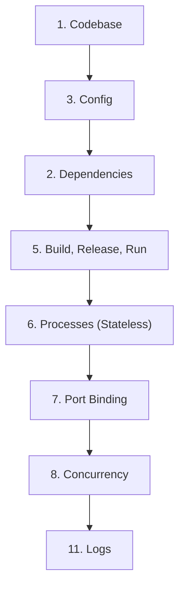

## 📌 Ozet
12-Factor App, modern, ölçeklenebilir ve bulut tabanlı (cloud-native) yazılımlar geliştirmek için kullanılan 12 altın kuraldır. Heroku nun kurucuları tarafından oluşturulan bu metodoloji, uygulamanın taşınabilirliğini ve sürekli dağıtımını (CI/CD) kolaylaştırır.

## 🧠 Detay

### Kritik Faktörlerden Bazıları
- **III. Config:** Ayarlar kodun içinde değil, ortam değişkenlerinde (Env Vars) tutulmalıdır.
- **VI. Processes:** Uygulama "stateless" (durumsuz) olmalı; veriler bir veritabanı veya cache de saklanmalıdır.
- **XI. Logs:** Uygulama log yazma yönetimiyle uğraşmamalı, logları "stdout" a bir akış olarak vermelidir.

## 💡 Baglantilar
- [[SE - Clean Code Prensipleri ve Best Practices]]
- [[API - Production Deployment (Gunicorn, Uvicorn, Nginx)]]
